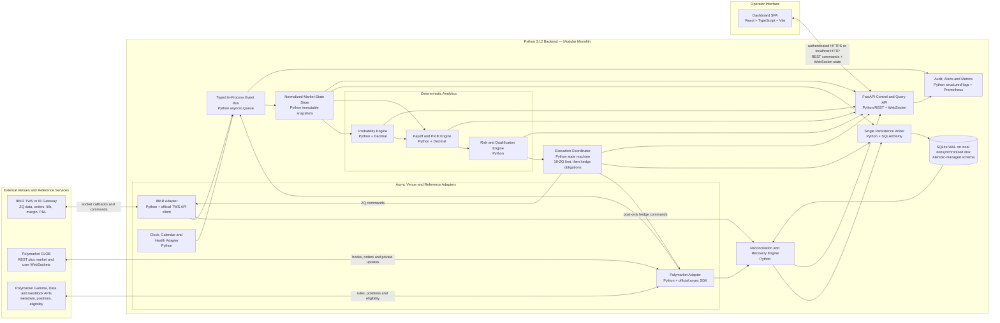

# ZQ–Polymarket Arbitrage Engine

Version: 0.1 Draft for Review  
Date: 2026-08-18  
Status: Documentation only; implementation and live trading are not authorized  
Primary reference strategy: September 16, 2026 FOMC decision, September 2026 30-Day Federal Funds futures (`ZQU6`)

## 1. Executive Decision

The recommended system is a local, event-driven trading service with a browser dashboard. It will consume executable IBKR ZQ quotes and Polymarket order books, calculate CME-style rate probabilities and conservative cross-venue hedge P&L, and submit orders only when every pricing, liquidity, margin, compliance, and operational control passes.

The trading sequence is fixed by mandate: each child order submits exactly 10 ZQ contracts first. Every incremental ZQ execution creates a hedge obligation. The engine then submits only the Polymarket quantity corresponding to the newly filled ZQ quantity. It does not wait for all 10 ZQ contracts to fill, and it never opens the Polymarket leg before a ZQ execution is confirmed.

The correct trigger is not a headline probability difference. The trigger is the minimum modeled terminal P&L after walking executable order-book depth, applying commissions and current Polymarket fees, including quantity rounding, and deducting configurable slippage and model-risk reserves. A trade is eligible only if this conservative P&L exceeds both an absolute dollar threshold and a return-on-capital threshold.

This is not risk-free arbitrage in the legal or economic sense. ZQ settles to the calendar-month average EFFR, while Polymarket resolves under market-specific written rules. The engine can produce a payoff locked across a configured scenario set, but EFFR basis, outcomes outside that set, resolution interpretation, partial-fill latency, venue failure, and jurisdiction restrictions remain material risks.

## 2. Approval Boundary

This document authorizes no code implementation, API login, credential access, order submission, cancellation, wallet action, or broker action. Implementation begins only after explicit approval of this specification and resolution of the open decisions in Section 18.

The future implementation must launch in `READ_ONLY` mode. Progression to `PAPER`, `SHADOW`, and `LIVE_ARMED` requires separate acceptance gates. Restarting the service must always return it to `READ_ONLY`; live trading must require a fresh manual arm action.

## 3. Scope

### 3.1 In Scope for Version 1

1. Stream live bid, ask, size, timestamp, and market-data type for the required ZQ contracts through IBKR TWS or IB Gateway.

2. Stream Polymarket level-2 order books for the configured Yes and No outcome tokens.

3. Calculate the CME-style FOMC probability tree, the executable ZQ-implied price of risk, Polymarket probabilities, probability differences, full intermediate calculations, and conservative hedge P&L.

4. Display signals, inputs, calculations, payoff scenarios, liquidity, order state, positions, margin, P&L, data health, and alerts on a local dashboard.

5. Submit one ZQ child order of exactly 10 contracts when the configured net-profit and risk thresholds pass.

6. On every incremental ZQ fill, immediately submit the corresponding Polymarket hedge amount, monitor its lifecycle, and track any residual exposure.

7. Persist every quote snapshot used for a signal, calculation version, order request, venue response, execution, fee, position, state transition, manual action, and reconciliation result.

8. Recover deterministically after a process or network restart without duplicating orders.

### 3.2 Explicitly Out of Scope for Version 1

1. Cross-account allocation, multiple IBKR accounts, multiple Polymarket wallets, portfolio optimization across unrelated events, and autonomous market discovery.

2. Market making, passive two-sided quoting, leverage optimization, or hidden assumptions about Polymarket market rules.

3. Automatic trading when the deployment location is blocked or close-only, or when the market's written resolution rules have not been manually approved.

4. Treating CME FedWatch probabilities as objective forecasts or treating a positive expected value as a locked profit.

## 4. Economic Model and Contract Mapping

### 4.1 ZQ Settlement

For a ZQ contract month `m`:

$$
R_m = 100-F_m
$$

where `F_m` is the futures price and `R_m` is the implied average EFFR in percentage points.

The final ZQ settlement is:

$$
S_m = 100-\operatorname{round}_{0.001}\left(\frac{1}{D_m}\sum_{d=1}^{D_m}EFFR_d\right)
$$

Every calendar day is included. For the September 16, 2026 decision, the working convention is 16 days at the pre-decision EFFR and 14 days at the post-decision EFFR, assuming the new rate is effective September 17.

The post-decision weight is therefore:

$$
w=\frac{14}{30}=46.6667\%
$$

One full-month ZQ basis point is modeled at approximately `$41.67` per contract. One full futures price point is therefore approximately `$4,167` per contract.

### 4.2 September Scenario Settlements

With pre-meeting EFFR `r_0` and a decision move `b` in basis points:

$$
S(b)=100-100\left(r_0+\frac{b}{10,000}w\right)
$$

Using `r_0 = 3.63%`:

| Decision move | September average EFFR | Theoretical ZQU6 settlement |
|---:|---:|---:|
| 0 bp | 3.630000% | 96.370000 |
| +25 bp | 3.746667% | 96.253333 |
| +50 bp | 3.863333% | 96.136667 |

### 4.3 Hedge Quantities

Let `M = $4,167` per futures price point. The Polymarket shares needed to offset the ZQ payoff difference between the zero-move state and outcome `b` are:

$$
q(b)=M\left[S(0)-S(b)\right]
$$

For one ZQU6 contract:

$$
q(25)=25\times\frac{14}{30}\times 41.67=486.15\text{ shares}
$$

$$
q(50)=50\times\frac{14}{30}\times 41.67=972.30\text{ shares}
$$

For the mandated 10-contract ZQ child order, a complete fill creates maximum hedge obligations of `4,861.50` exact-25 Yes shares and `9,723.00` 50-plus Yes shares for the long-ZQ bundle, subject to the configured strategy direction and outcome set.

### 4.4 Market Mapping Is a Controlled Configuration

The engine must not infer financial meaning from a Polymarket title alone. Each configured leg requires the event slug, market slug, condition ID, Yes token ID, No token ID, outcome label, exact resolution rule text, resolution source, end date, tick size, minimum order size, negative-risk flag, fee schedule, and a hash of the approved rule text.

Trading stops if any identifier, rule text, token mapping, fee schedule, order-accepting status, or resolution source changes. Re-arming requires manual approval of the revised mapping.

## 5. Probability Calculations

### 5.1 CME-Style Reference Probability Tree

The dashboard will reproduce the CME anchor-month method for reference and audit. CME assumes 25 bp increments, a proportional EFFR response, and propagation from full months without FOMC meetings.

For the September and October 2026 sequence, the required inputs are August (`ZQQ6`), September (`ZQU6`), October (`ZQV6`), and November (`ZQX6`). November is the first complete non-meeting month after the October 28 meeting.

For October, with 28 calendar days through the meeting and three post-meeting days:

$$
EFFR_{end,Oct}=R_{Nov}
$$

$$
EFFR_{start,Oct}=\frac{31R_{Oct}-3R_{Nov}}{28}
$$

The September end rate equals the October start rate:

$$
EFFR_{end,Sep}=EFFR_{start,Oct}
$$

With August as the September start anchor:

$$
\Delta EFFR_{Sep}=EFFR_{end,Sep}-R_{Aug}
$$

The expected number of 25 bp steps is:

$$
x=\frac{\Delta EFFR_{Sep}}{0.25}
$$

If `k = floor(x)` and `u = x-k`, the adjacent meeting outcomes are `25k` bp with probability `1-u` and `25(k+1)` bp with probability `u`. The same process is applied to October and multiplied through the tree to generate cumulative target-range probabilities.

The observed September contract is retained as a cross-check:

$$
Residual_{Sep}=R_{Sep}-\frac{16\,EFFR_{start,Sep}+14\,EFFR_{end,Sep}}{30}
$$

A residual outside the configured tolerance is a model-health warning or stop condition, not a number to conceal.

### 5.2 Executable ZQ Probability

The CME-style probability tree is a reference calculation using contract prices. Trading decisions require side-specific executable prices.

For a strictly binary outcome set of hold versus +25 bp:

$$
p_{ZQ,long}=\frac{S(0)-F_{ask}}{S(0)-S(25)}
$$

$$
p_{ZQ,short}=\frac{S(0)-F_{bid}}{S(0)-S(25)}
$$

The long formula is used when the strategy buys ZQ; the short formula is used when the strategy sells ZQ. Values outside `[0,1]` are displayed but invalidate the binary-probability interpretation.

When three or more outcomes are possible, one ZQ price identifies only an expected rate move, not a unique probability for every outcome. The dashboard must never fabricate independent exact-25 and 50-plus probabilities from one futures price. Bucket probabilities come from the explicit FedWatch-style tree; trade profitability comes from the scenario payoff matrix in Section 6.

### 5.3 Polymarket Probability

The dashboard will show four distinct Polymarket measures for each token:

| Measure | Definition | Use |
|---|---|---|
| Best bid | Highest executable sell price | Marking and reverse-direction analysis |
| Best ask | Lowest executable buy price | Small-quantity indication only |
| Mid | `(best bid + best ask) / 2` | Display only; never an execution input |
| Depth VWAP | Total cost divided by shares across required ask levels | Signal and order sizing |

The probability comparison panel will show `FedWatch probability − Polymarket mid` for intuition and `ZQ executable edge − Polymarket depth VWAP` for actionability. Only the second can contribute to a trade signal.

## 6. Arbitrage and Profit Engine

### 6.1 Binary Long-ZQ / Buy-Yes Package

For hold versus +25 bp, buy `n` ZQ contracts at `F_ask` and buy:

$$
q=nM[S(0)-S(25)]
$$

Yes shares at executable depth VWAP `A_Y`.

The gross terminal P&L is the same in the two modeled states:

$$
Gross=q(p_{ZQ,long}-A_Y)
$$

Equivalently:

$$
Gross=nM[S(0)-F_{ask}]-qA_Y
$$

### 6.2 Binary Short-ZQ / Buy-No Package

Sell `n` ZQ contracts at `F_bid` and buy `q` No shares at depth VWAP `A_N`:

$$
Gross=q[(1-p_{ZQ,short})-A_N]
$$

### 6.3 Three-State September Bundle

For the modeled states `0 bp`, `+25 bp`, and `+50 bp`, the existing long-ZQ bundle is:

| Position per ZQ contract | Quantity |
|---|---:|
| Long ZQU6 | 1 contract |
| Buy exact-25 Yes | 486.15 shares |
| Buy 50-plus Yes | 972.30 shares |

Within those three states, the outcome-token payout offsets the futures loss relative to the zero-move settlement.

The reverse bundle, assuming the same two separate binary markets, is:

| Position per ZQ contract | Quantity |
|---|---:|
| Short ZQU6 | 1 contract |
| Buy exact-25 No | 486.15 shares |
| Buy 50-plus No | 972.30 shares |

The engine will not hardcode these tables as universal truth. It will construct a payoff matrix from the approved market rules and solve the hedge quantities. The configured quantities must reconcile to the analytical values above within the rounding tolerance.

### 6.4 Scenario Payoff Matrix

For each approved outcome `k`, total terminal P&L is:

$$
PnL_k=PnL^{ZQ}_k+\sum_j q_j(Payout_{j,k}-Price_j)-Costs-Reserves
$$

The headline signal metric is:

$$
LockedNetProfit_{min}=\min_k(PnL_k)
$$

The trade may proceed only when every scenario in the approved coverage set produces net P&L above the threshold. The dashboard also shows P&L for unapproved tail scenarios, but a positive expected P&L cannot override a negative covered-state minimum.

### 6.5 Costs and Reserves

Net P&L deducts IBKR commissions and exchange fees, actual Polymarket fee curves, depth slippage, quantity-rounding reserve, ZQ price-movement reserve, Polymarket price-movement reserve, EFFR basis reserve, and an operational-risk reserve.

Committed capital is defined consistently as Polymarket cash required for the hedge plus the IBKR previewed incremental initial margin plus explicit operating and emergency reserves. Return-on-capital comparisons use this denominator rather than futures notional value.

Current Polymarket documentation specifies market-level fees and a taker-fee form based on shares, fee rate, and `p(1-p)`. The engine must query the current market configuration and use the fee returned for the actual match. A workbook input of zero fees is not acceptable as a live-trading assumption.

The dashboard will display gross locked P&L, each cost component, total costs, net locked P&L, capital committed, margin consumed, net return on committed capital, and the exact threshold comparison.

### 6.6 Illustrative 10-Contract Calculation

This example uses the last workbook inputs solely to demonstrate the calculation path. It is not a trade recommendation.

| Input | Value |
|---|---:|
| ZQU6 executable buy price | 96.325 |
| Zero-move theoretical settlement | 96.370 |
| Exact-25 Yes depth price | 0.2800 |
| 50-plus Yes depth price | 0.0084 |
| ZQ contracts | 10 |

The zero-move futures value is:

$$
10\times4,167\times(96.370-96.325)=\$1,875.15
$$

The Polymarket purchase cost is:

$$
4,861.50\times0.28+9,723.00\times0.0084=\$1,442.89
$$

The modeled gross payoff floor is therefore approximately `$432.26` before commissions, current Polymarket fees, slippage reserves, and model-risk reserves. It is valid only across the defined 0/+25/+50 scenario set and only if all quantities execute at the stated prices.

## 7. Signal Qualification

A signal is `TRADEABLE` only when all of the following are true:

1. IBKR and Polymarket connections are healthy, authenticated where required, and below the maximum reconnect count.

2. Every required quote and book is fresh, synchronized to the system clock, and live rather than delayed, frozen, or stale.

3. The ZQ contract is uniquely resolved by IBKR contract ID, has the expected multiplier, tick size, expiry, trading class, currency, and exchange.

4. Every Polymarket token and rule hash matches the approved configuration; the market accepts orders; the current tick size, minimum order size, negative-risk flag, and fee schedule have been refreshed.

5. Polymarket's live geographic eligibility check permits opening orders, and the operator has affirmed legal and account eligibility.

6. Available Polymarket depth is sufficient for the entire 10-contract maximum hedge obligation at or inside the configured worst price before the ZQ order is submitted.

7. A side-specific IBKR `what-if` preview passes and projected full excess liquidity, available funds, margin cushion, and absolute cash reserves remain above configured limits.

8. The minimum covered-scenario P&L after all costs and reserves exceeds both `min_net_profit_usd` and `min_return_on_capital_bps`.

9. The maximum residual P&L loss in every tail scenario is inside its limit, and no unmodeled scenario has been silently excluded.

10. There is no active batch, unresolved hedge deficit, unmatched Polymarket trade, reconciliation difference, kill switch, manual pause, or critical alert.

11. ZQ is inside the allowed trading session, the FOMC cutoff buffer has not begun, and neither venue is in maintenance or degraded status.

## 8. Execution State Machine

### 8.1 Batch States

| State | Meaning | Permitted next actions |
|---|---|---|
| `IDLE` | No live batch or deficit | Evaluate signals |
| `QUALIFIED` | Signal and all gates passed | Run final preflight |
| `ZQ_SUBMITTED` | Exactly 10 ZQ sent | Monitor, modify within policy, or cancel remainder |
| `ZQ_PARTIAL` | One or more ZQ contracts filled | Create hedge obligation immediately |
| `POLY_HEDGE_PENDING` | Polymarket request accepted but not confirmed | Monitor user channel and timeout |
| `PARTIALLY_HEDGED` | Some required Polymarket shares filled | Retry within cap or emergency action |
| `HEDGED` | Filled ZQ quantity fully mapped to confirmed Polymarket fills | Continue monitoring remaining ZQ order |
| `COMPLETE` | ZQ order terminal and all fill obligations hedged | Reconcile and return to idle |
| `RECOVERY` | Restart or uncertain venue state | Query both venues; no new orders |
| `HALTED` | Kill switch or critical failure | Cancel safe-to-cancel orders; manual review |

### 8.2 ZQ-First Partial-Fill Logic

The submitted ZQ order quantity is always exactly 10 contracts. An IBKR execution is identified by `execId`, not only by cumulative `orderStatus`, because every partial fill has a separate execution identifier.

For each new execution delta `d`:

$$
Due_{25} \mathrel{+}= d\times486.15
$$

$$
Due_{50+} \mathrel{+}= d\times972.30
$$

or the corresponding quantities from the active payoff-matrix strategy.

The engine subtracts confirmed Polymarket fills from the due ledger and submits only the remaining deficit. Duplicate IBKR callbacks or reconnect replays cannot create a duplicate hedge because `execId`, batch ID, strategy version, and obligation ID are persisted with uniqueness constraints.

### 8.3 Polymarket Order Policy

The default hedge order is a `BUY` limit order submitted as good-till-cancelled with `post_only=True`. It must add liquidity and must never accept the current ask. If the order would match immediately because the book moved between observation and submission, Polymarket must reject it rather than execute it as a taker.

Immediately before signing, the engine refreshes the book and chooses the highest permissible maker price. Under a normal uncrossed book, the default price is the current highest bid, bounded by the strategy's hard price cap:

$$
P_{post}=\min(P_{best\ bid},P_{hard\ cap})
$$

The price is rounded down to the current valid tick. A missing best bid, crossed or locked book, stale snapshot, changed tick size, insufficient balance or allowance, or a calculated price above the hard cap prevents submission. The order size is the exact outstanding share obligation, rounded according to the approved hedge-rounding policy and the market's current minimum size and precision.

Only one live default hedge order may exist for each token and hedge obligation. A `live` response means the order is resting and is not a fill. A response of `accepted`, `matched`, `delayed`, or `unmatched` is never sufficient by itself to close the obligation. The user WebSocket and authenticated trade query must identify the executed amount; only confirmed executed shares reduce the due ledger.

If the order is unfilled or partially filled after `polymarket_post_only_reprice_seconds`, the engine cancels the remaining quantity, confirms the cancellation, refreshes the book, and reposts the residual at the new highest permissible maker price. It may do this only up to `polymarket_post_only_max_reprices` and never beyond `max_unhedged_seconds`. Cancel/replace operations retain the same obligation ID and use a new idempotency sequence so that a late fill cannot create an overhedge.

Signal qualification and the dashboard show both passive-post expected P&L and emergency-cap P&L. A marketable Polymarket order is not part of the default path. Crossing the book is permitted only under the separately approved emergency hierarchy in Section 8.4, after the passive timeout or another critical hedge condition. `CONFIRMED` is the final successful lifecycle state; `FAILED` is a critical hedge incident.

### 8.4 Failure and Emergency Policy

If the Polymarket hedge cannot be filled inside the price and time limits, the engine cancels the unfilled portion of the ZQ order immediately. It then follows one pre-approved emergency policy for the already filled ZQ contracts: cross the Polymarket book up to an emergency cap, unwind the uncovered ZQ quantity, or halt for manual action.

The engine must never invent this choice during an incident. Section 18 requires the operator to select the emergency hierarchy and price caps before live mode is available.

## 9. Risk Management

### 9.1 Hard Stops

| Control | Default design behavior |
|---|---|
| Geographic eligibility blocked or close-only | No opening orders; closing logic only if separately approved |
| IBKR market data not live | No signal and no order |
| Any required quote stale | Cancel unfilled ZQ remainder; no new batch |
| Polymarket market rule or token mapping changed | Halt and require manual re-approval |
| Margin preview missing or warning returned | No trade |
| Polymarket balance or allowance insufficient | No trade |
| Unhedged ZQ fill exceeds limit or timeout | Cancel remaining ZQ and execute emergency policy |
| Venue state uncertain after restart | Recovery mode; reconcile before any new order |
| Daily loss limit breached | Halt for the day |
| Position, order, or cash reconciliation mismatch | Halt and alert |
| Outcome outside approved payoff coverage | No trade unless explicitly covered and within tail-risk limit |

### 9.2 Configurable Limits

The initial configuration will expose `min_net_profit_usd`, `min_return_on_capital_bps`, `max_zq_position`, `max_open_batches`, `max_unhedged_zq_contracts`, `max_unhedged_seconds`, `max_zq_slippage_ticks`, `max_polymarket_price_slippage`, `polymarket_post_only_reprice_seconds`, `polymarket_post_only_max_reprices`, `polymarket_hard_price_cap`, `min_full_excess_liquidity_usd`, `min_margin_cushion_ratio`, `max_daily_loss_usd`, `max_strategy_drawdown_usd`, `max_tail_loss_usd`, `max_quote_age_ms`, and event-time trading cutoffs.

Risk limits are read from a versioned configuration. Changes require an authenticated manual action, an audit entry, and re-arming. The dashboard cannot silently change a limit while an order is live.

### 9.3 Basis and Tail Risk

The 50-plus token payout is capped at one dollar per share, while the ZQ loss continues to grow if the Fed moves more than +50 bp. A long-ZQ bundle sized to +50 bp is short the +75 bp and larger tail. The dashboard must show explicit +75 bp and +100 bp stress P&L even if those scenarios are assigned zero FedWatch probability.

ZQ settles from actual EFFR observations, not the target-range upper bound. The model therefore carries EFFR-to-target basis risk, calendar carry-forward risk, settlement rounding, and potential technical deviations. These receive an explicit reserve and stress panel.

## 10. Margin, Capital, and P&L

### 10.1 IBKR Margin

Before each ZQ order, the engine submits a non-transmitting margin preview and records projected initial margin, maintenance margin, excess liquidity, available funds, commission, equity-with-loan impact, and all warning text.

The dashboard shows current and projected `NetLiquidation`, `TotalCashValue`, `InitMarginReq`, `MaintMarginReq`, `AvailableFunds`, `ExcessLiquidity`, `FullInitMarginReq`, `FullMaintMarginReq`, `FullAvailableFunds`, `FullExcessLiquidity`, `Cushion`, and `FuturesPNL` where available.

Account summary values that update slowly are timestamped and labeled accordingly. Position P&L is obtained from the dedicated IBKR P&L subscription and the local execution ledger rather than assuming every account metric updates tick by tick.

### 10.2 Polymarket Capital

The dashboard shows pUSD or current collateral balance, available balance, locked amount in open orders, token positions, allowances, market value, cash P&L, realized P&L, and redeemable value. The local ledger computes a real-time liquidation mark from executable bids; the Data API position values are used as an independent reconciliation source.

### 10.3 Strategy P&L Views

| Metric | Definition |
|---|---|
| IBKR daily P&L | Broker-reported daily P&L |
| IBKR realized/unrealized P&L | Broker-reported and locally reconciled values |
| Polymarket mark P&L | Current executable liquidation value minus cost and fees |
| Combined mark P&L | IBKR mark P&L plus Polymarket mark P&L minus recorded costs |
| Locked terminal P&L | Minimum terminal P&L across covered scenarios |
| Tail stress P&L | Minimum P&L across expanded stress scenarios |
| Residual exposure | Payoff and delta of filled ZQ not yet matched by confirmed token fills |

All P&L is shown in USD with venue timestamps, data age, and calculation version.

## 11. Dashboard Specification

### 11.1 Header and Control Bar

The fixed header shows mode, arm status, kill switch, IBKR connection, Polymarket connection, market-data type, eligibility, current time in UTC, New York, Chicago, and Taipei, quote age, active batch, and the highest alert severity.

The only live control actions are `Arm`, `Disarm`, `Pause New Trades`, `Cancel Unfilled`, and `Emergency Halt`. Every action requires confirmation and an audit reason. Credentials, private keys, and account identifiers are never rendered.

### 11.2 Probability and Middle-Calculation Panel

The panel shows all intermediate values rather than only the final probability:

| Block | Required fields |
|---|---|
| ZQ quotes | Contract, bid, ask, sizes, last, IBKR timestamp, local receipt time, live/delayed type |
| Monthly EFFR | `100 − price` for August through November |
| Calendar decomposition | Days before/after each meeting, start EFFR, average EFFR, end EFFR, residual |
| Meeting steps | Expected bp move, expected 25 bp steps, floor, remainder |
| FedWatch distribution | Per-meeting and cumulative target-range probabilities |
| Polymarket | Bid, ask, mid, depth VWAP, fee schedule, size available, token and rule status |
| Comparison | Mid probability gap, executable edge, timestamp mismatch, residual warning |

### 11.3 Profit Waterfall

For each candidate direction, the dashboard shows ZQ side and executable price, number of contracts, each Polymarket token and shares, current best bid and ask, proposed post-only price, hard cap, passive-post expected P&L, emergency-cap P&L, gross terminal P&L by scenario, IBKR costs, Polymarket fees, slippage reserves, model reserve, net scenario P&L, minimum net P&L, committed capital, margin, return, threshold, and pass/fail reason.

### 11.4 Execution and Hedge Monitor

The execution monitor shows batch ID, strategy version, ZQ order ID and permanent ID, original quantity 10, filled quantity, remaining quantity, average fill, each `execId`, required hedge shares by token, Polymarket order ID, post-only flag, posted price, current best bid and ask, submitted shares, matched shares, confirmed shares, deficit, order age, time to next reprice, reprice count, time to emergency threshold, and emergency state.

### 11.5 Margin and P&L Panel

The panel shows account net liquidation, cash, initial and maintenance margin, excess liquidity, projected post-order values, margin cushion, IBKR P&L, Polymarket P&L, combined P&L, locked terminal P&L, tail stress P&L, daily loss limit utilization, and strategy drawdown.

### 11.6 Audit and Health Panel

The panel shows last data messages, reconnects, dropped or out-of-order messages, stale feeds, API warnings, rejected orders, reconciliation status, rule hash, configuration version, software version, and the last manual control action.

## 12. Recommended Technical Architecture

The recommended version-1 architecture is a Python-first modular monolith rather than microservices. Every backend task—including venue connectivity, market-data normalization, calculations, risk, execution, reconciliation, persistence, API delivery, scheduling, observability, and automated tests—will be implemented in Python. TypeScript is restricted to the browser dashboard. A single backend process reduces inter-service latency and operational failure modes while preserving strict internal module boundaries and testability.

### 12.1 Detailed Architecture Diagram

### 12.2 Language and Technology Assignment

| Component | Language | Primary technology | Process and safety boundary |
|---|---|---|---|
| Backend application shell | Python 3.12 | `asyncio`, typed dataclasses or Pydantic models | One supervised process; fail closed if any critical task exits |
| IBKR adapter | Python | Official TWS API Python client over TWS/IB Gateway socket | Callback thread is bridged into the asyncio event loop; order IDs, permanent IDs, and `execId` values are preserved |
| Polymarket adapter | Python | Current official asynchronous Python SDK, pinned to an audited version | Separate public-market and authenticated-user streams; `post_only=True` for the default hedge path |
| Market-data normalization | Python | `asyncio.Queue`, immutable typed events, `Decimal` | Venue payloads are validated before entering trusted market state |
| Probability engine | Python | Pure typed Python with `Decimal`; NumPy only if vectorization is later justified | No network access and no side effects; deterministic unit-test surface |
| Payoff and profit engine | Python | Pure typed Python with `Decimal` | Scenario matrix, fees, reserves, hedge rounding, and minimum P&L are independently reproducible |
| Risk engine | Python | Pure typed Python and versioned configuration | Sole authority that can qualify a trade; default deny on missing or stale inputs |
| Execution coordinator | Python | Explicit finite-state machine on `asyncio` | Sole authority that can request orders; one serialized command lane per venue |
| Reconciliation and recovery | Python | Async venue queries plus local ledger comparison | Blocks new orders until orders, fills, positions, cash, and obligations reconcile |
| Persistence | Python | SQLAlchemy 2.x, Alembic, SQLite WAL; PostgreSQL migration path | One writer task prevents lock contention and preserves ordered audit history |
| Configuration and secrets | Python | `pydantic-settings` plus operating-system secret injection | `.env` is development-only; secrets are never sent to the browser or stored in the database |
| API server | Python | FastAPI, Uvicorn, REST, backend WebSocket | Authenticated commands, read models, health, and live dashboard updates |
| Scheduling and background work | Python | Native `asyncio` tasks and monotonic timers | No separate task language, Node backend, Celery, or Redis in version 1 |
| Observability | Python | Structured JSON logging, Prometheus client, audit event models | Redaction runs before serialization; critical alerts are persisted |
| Backend testing | Python | `pytest`, `pytest-asyncio`, Hypothesis, deterministic venue simulators | Calculation, state-machine, reconnect, duplicate-event, and crash-recovery coverage |
| Dashboard | TypeScript | React, Vite, TanStack Query, native WebSocket client | Browser contains presentation and authenticated controls only; no pricing or risk authority |
| Dashboard testing | TypeScript | Vitest and Playwright | Visual, interaction, and control-confirmation tests; no backend trading logic duplicated |

### 12.3 Runtime Execution Model

1. The IBKR and Polymarket adapters translate external callbacks into typed Python events and publish them onto bounded `asyncio.Queue` channels. Backpressure or a queue overflow is a trading halt, not a dropped-message condition.

2. A single market-state reducer creates immutable, timestamped snapshots. Probability, payoff, profit, and risk calculations consume the same snapshot ID so the dashboard and order decision cannot use different market states.

3. The execution coordinator is the only module allowed to issue venue commands. It submits exactly 10 ZQ contracts, converts each unique IBKR execution into a persisted hedge obligation, and manages one post-only Polymarket order per token and obligation.

4. A single persistence-writer task serializes state transitions, external commands, acknowledgments, fills, reconciliations, and audit events. A venue command is not issued until its intent and idempotency key are durable.

5. The FastAPI layer exposes read models and a narrow authenticated command surface. The React dashboard never computes authoritative probabilities, profit, risk approval, hedge size, or execution state.

6. On startup or reconnect, the backend enters `RECOVERY`, reads the local ledger, queries both venues, rebuilds obligations, and remains unable to trade until reconciliation succeeds.

### 12.4 Deployment Topology

The backend runs as one supervised Python service on the same machine or low-latency local network as TWS/IB Gateway. The compiled TypeScript dashboard is served as static assets by FastAPI or a localhost-only web server. Version 1 has no distributed message broker, container requirement, Node.js backend service, or independently deployed worker.

The IBKR integration uses the supported TWS/IB Gateway socket protocol through the official Python client. The Polymarket integration uses the current official asynchronous Python SDK, pins the exact production-approved version in the dependency lock, and does not hand-roll signing unless a later security review explicitly approves it.

Source code may remain in the OneDrive project workspace, but the live SQLite database, write-ahead log, broker logs, and transient order-state files must reside on a nonsynchronized local disk. SQLite WAL must not run inside OneDrive, another cloud-synchronized folder, or a network share. Encrypted backups may be copied separately after a consistent database checkpoint.

## 13. Persistence and Idempotency

The database requires at least the following tables:

| Table | Core purpose |
|---|---|
| `config_versions` | Immutable strategy and risk configuration versions |
| `market_mappings` | Approved venue identifiers and resolution-rule hashes |
| `quotes` | ZQ and Polymarket top-of-book snapshots |
| `order_books` | Polymarket depth used for each calculation and order |
| `signals` | Every evaluated opportunity and gate result |
| `batches` | One 10-ZQ execution state machine per opportunity |
| `orders` | Normalized IBKR and Polymarket order records |
| `executions` | Unique venue fills and status lifecycle |
| `hedge_obligations` | Shares due, filled, confirmed, and residual by ZQ execution |
| `positions` | Venue and strategy positions |
| `margin_snapshots` | Current and what-if account metrics |
| `pnl_snapshots` | Venue, combined, terminal, and stress P&L |
| `reconciliations` | Expected versus venue-reported state |
| `alerts` | Severity, state, acknowledgment, and resolution |
| `audit_log` | Manual actions, mode changes, limit changes, and reasons |

Each external action has an idempotency key derived from the batch ID, venue, leg, strategy version, and obligation sequence. IBKR `execId`, permanent ID, and order ID are stored independently. Polymarket order ID, trade ID, transaction hash, token ID, and lifecycle state are also stored independently.

## 14. Security and Compliance

Private keys, API secrets, passphrases, and broker credentials must not be stored in source files, the database, browser storage, logs, screenshots, or dashboard payloads. The implementation will use operating-system protected secret storage or a dedicated local secret manager, with environment injection only at process start.

The dashboard binds to localhost by default. Remote access is out of scope until transport encryption, authentication, authorization, and network controls are reviewed.

Polymarket requires L1 wallet signing and L2 API authentication for trading. The private key must remain local. The engine will use the official SDK for signing and will redact signatures and headers from logs.

The workspace timezone is Asia/Taipei, and Polymarket's current geographic-restrictions documentation lists Taiwan as close-only. This does not prove the deployment IP location, but it is a critical go-live constraint. The engine must call the official geoblock endpoint at startup, before arming, and periodically. A blocked or close-only result prevents opening orders. No VPN, proxy, routing, or circumvention feature will be designed or implemented.

## 15. Data Freshness and Time

Every message stores the venue timestamp, local monotonic receipt time, UTC wall-clock time, and calculated age. Signal calculations require all legs to fall within a configurable synchronization window.

The engine uses UTC internally. It displays America/New_York for FOMC timing, America/Chicago for CME trading context, and Asia/Taipei for the operator. Clock drift beyond the configured tolerance blocks trading.

IBKR market data must be explicitly identified as live. A delayed or frozen callback disables signals. Polymarket books are seeded from a REST snapshot and maintained through the market WebSocket; sequence or hash inconsistencies force a fresh snapshot before the book is trusted again.

## 16. Testing and Release Plan

### 16.1 Calculation Tests

1. Reproduce the workbook's `14/30` weight, `486.15` exact-25 shares, and `972.30` 50-plus shares per ZQU6.

2. Reproduce the August-through-November FedWatch probability tree and the September cross-contract residual.

3. Prove equal payoff across every covered outcome for each bundle before costs, then reconcile net payoff after all costs.

4. Test cuts, +75 bp, +100 bp, non-25 bp EFFR movement, settlement rounding, negative probability outputs, empty books, crossed books, and fee changes.

### 16.2 Execution Tests

1. Simulate ZQ fills of `1`, `3`, `6`, and `10` contracts and verify incremental rather than cumulative duplicate Polymarket orders.

2. Simulate duplicate, delayed, reordered, corrected, and missing IBKR execution callbacks.

3. Simulate Polymarket full fill, partial fill, delayed match, rejection, permanent failure, WebSocket disconnect, and REST/WebSocket disagreement.

4. Terminate the process at every state transition, restart it, and prove that no duplicate order is created.

5. Verify that a 10-ZQ order is never sent when full 10-contract hedge depth, margin, eligibility, or data freshness is inadequate.

### 16.3 Release Gates

| Stage | Required behavior | Exit requirement |
|---|---|---|
| `READ_ONLY` | Live data, calculations, dashboard, no order methods enabled | Formula and data reconciliation approved |
| `PAPER` | IBKR paper orders and simulated Polymarket fills | State-machine and recovery tests pass |
| `SHADOW` | Live data and signals; proposed orders logged but never submitted | Minimum observation period and zero critical reconciliation errors |
| `LIMITED_LIVE` | One batch maximum, small approved capital, manual arm | Operator sign-off after every batch |
| `LIVE_ARMED` | Configured automation within hard limits | Separate explicit approval |

There is no reliable Polymarket paper venue assumed. Before live use, the execution adapter will be tested with a deterministic simulator and then, only where legally eligible, with a separately approved minimal production validation.

## 17. Acceptance Criteria

Version 1 is complete only when the following criteria are demonstrated:

1. The dashboard reproduces every probability and hedge intermediate calculation and identifies the exact source and age of each input.

2. The payoff engine matches the workbook hedge ratios and independently reconciles all scenario P&L.

3. A qualified batch submits exactly 10 ZQ contracts, never another initial child size.

4. Every new ZQ fill creates exactly one incremental hedge obligation and exactly the correct corresponding Polymarket amount.

5. No Polymarket opening order is submitted before a confirmed ZQ execution.

6. No new ZQ order is submitted while a prior hedge deficit or uncertain order state exists.

7. Margin, available funds, excess liquidity, venue P&L, combined P&L, locked terminal P&L, and tail stress P&L are visible and timestamped.

8. Restart recovery reconciles both venues and creates no duplicate orders.

9. All hard stops are proven with automated tests and visible dashboard reasons.

10. Credentials never appear in logs, database records, browser payloads, or screenshots.

11. Live opening orders remain impossible when the geoblock check is blocked or close-only.

12. `LIVE_ARMED` remains impossible until a separate operator approval is recorded after shadow and limited-live review.

## 18. Decisions Required Before Implementation

1. Confirm whether version 1 trades only the September 16, 2026 event or must support a generic sequence of future FOMC meetings from the first release. The recommendation is to make the calculation engine generic but enable only the September strategy initially.

2. Provide and approve the exact Polymarket event slugs, condition IDs, outcome token IDs, and resolution rules. Market titles are insufficient.

3. Confirm the deployment jurisdiction and whether the live Polymarket geoblock endpoint permits opening orders. If the deployment remains in a close-only location, version 1 can be built as analytics and position monitoring only, not as an opening-order engine.

4. Define `min_net_profit_usd`, `min_return_on_capital_bps`, daily loss limit, maximum total ZQ position, minimum excess liquidity, margin cushion, maximum tail loss, price slippage, and data-age limits.

5. Select the ZQ order type and chase policy. The recommendation is a marketable limit with a maximum number of price revisions and a short time-in-force, never an uncapped market order.

6. Select the emergency hierarchy for an unhedged ZQ fill. The recommendation is: attempt the Polymarket hedge to an emergency cap, cancel remaining ZQ, then immediately flatten the uncovered ZQ if the hedge remains incomplete beyond the timeout.

7. Confirm whether only one 10-contract batch may be active at a time. The recommendation for version 1 is one active batch and a maximum net new position of 10 ZQ until the first batch is fully reconciled.

8. Confirm the Polymarket rounding policy. The recommendation is to calculate the exact obligation, submit supported precision under the current market rules, and conservatively round the hedge up where that reduces the defined tail risk while displaying the overhedge.

9. Confirm whether the system may close existing positions automatically when a risk limit is breached. Opening authority does not automatically imply liquidation authority; this requires a separate rule.

## 19. Authoritative Interface References

1. CME's [FedWatch methodology](https://www.cmegroup.com/articles/2023/understanding-the-cme-group-fedwatch-tool-methodology.html) documents the 25 bp probability tree and non-meeting anchor process.

2. CME's [30-Day Federal Funds contract page](https://www.cmegroup.com/markets/interest-rates/stirs/30-day-federal-fund.contractSpecs.html) provides the product and settlement resources.

3. The Federal Reserve's [2026 FOMC calendar](https://www.federalreserve.gov/monetarypolicy/fomccalendars.htm) lists the September 15–16 and October 27–28 meetings.

4. The New York Fed's [EFFR methodology](https://www.newyorkfed.org/markets/reference-rates/additional-information-about-reference-rates) defines the transaction data and volume-weighted-median calculation.

5. IBKR's [TWS API introduction](https://www.interactivebrokers.com/docs/tws-api/doc/introduction), [order placement](https://www.interactivebrokers.com/docs/tws-api/doc/orders/place-order/introduction), [order-placement considerations](https://www.interactivebrokers.com/docs/tws-api/doc/orders/place-order/order-placement-considerations), [account values](https://www.interactivebrokers.com/docs/tws-api/doc/account-portfolio-data/account-updates/account-value-keys), and [account P&L](https://www.interactivebrokers.com/docs/tws-api/doc/account-portfolio-data/profit-loss-pn-l/receive-p-l-for-accounts) define the required broker callbacks and metrics.

6. Polymarket's [authentication](https://docs.polymarket.com/api-reference/authentication), [market WebSocket](https://docs.polymarket.com/market-data/websocket/market-channel), [order placement](https://docs.polymarket.com/trading/place-orders), [fee model](https://docs.polymarket.com/trading/fees), [positions API](https://docs.polymarket.com/api-reference/core/get-current-positions-for-a-user), [CLOB V2 migration](https://docs.polymarket.com/v2-migration), and [geographic restrictions](https://docs.polymarket.com/api-reference/geoblock) define the required order, fill, balance, fee, and eligibility behavior.

## 20. Recommended Approval Statement

Approval should be explicit and narrow: “I approve Version 0.1 of `ZQ_POLYMARKET_ARBITRAGE_ENGINE_DESIGN.md` for implementation through the `READ_ONLY` and `PAPER` stages only. Live order placement remains unapproved.”

Any approval that does not resolve the jurisdiction gate and the decisions in Section 18 will authorize only the analytics dashboard and simulated execution engine.
