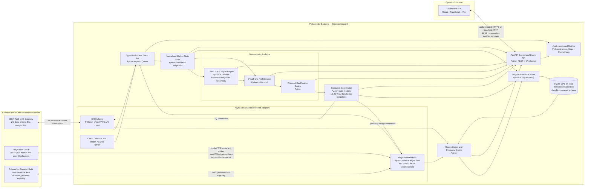

# ZQ–Polymarket Arbitrage Engine

Version: 0.3 Approved for READ_ONLY and PAPER Implementation 
Date: 2026-08-26 
Status: READ_ONLY and PAPER implementation authorized; live trading remains unauthorized
Primary reference strategy: September 16, 2026 FOMC decision, September 2026 30-Day Federal Funds futures (`ZQU6`)

## 1. Executive Decision

The recommended system is a local, event-driven trading service with a browser dashboard. It will consume executable IBKR ZQ quotes and WebSocket-maintained Polymarket order books, calculate a direct `ZQU6`-implied September move, a clearly labeled adjacent-outcome probability model, normalized Polymarket expected move, secondary CME-style diagnostics, and conservative cross-venue hedge P&L. It may submit orders only when every pricing, liquidity, margin, compliance, and operational control passes.

The trading sequence is fixed by mandate: each child order submits exactly 10 ZQ contracts first. Only one child batch may be active at a time, while fully reconciled sequential batches may accumulate to a maximum aggregate ZQ position of 100 contracts. Every incremental ZQ execution creates a hedge obligation. The engine then submits only the Polymarket quantity corresponding to the newly filled ZQ quantity. It does not wait for all 10 ZQ contracts to fill, and it never opens the Polymarket leg before a ZQ execution is confirmed.

The correct trigger is not a headline probability difference. The trigger is the minimum modeled terminal P&L after walking executable order-book depth, applying commissions and current Polymarket fees, including quantity rounding, and deducting configurable slippage and model-risk reserves. A trade is eligible only if this conservative P&L exceeds both an absolute dollar threshold and a return-on-capital threshold.

This is not risk-free arbitrage in the legal or economic sense. ZQ settles to the calendar-month average EFFR, while Polymarket resolves under market-specific written rules. The engine can produce a payoff locked across a configured scenario set, but EFFR basis, outcomes outside that set, resolution interpretation, partial-fill latency, venue failure, and jurisdiction restrictions remain material risks.

## 2. Approval Boundary

On August 20, 2026, the owner authorized implementation through `READ_ONLY` and `PAPER`, including connection to the running paper TWS endpoint configured in `.env`. Live Polymarket orders, live IBKR orders, credential creation, token approvals, fund movement, and Polygon transactions remain unauthorized.

The future implementation must launch in `READ_ONLY` mode. Progression to `PAPER`, `SHADOW`, and `LIVE_ARMED` requires separate acceptance gates. Restarting the service must always return it to `READ_ONLY`; live trading must require a fresh manual arm action.

## 3. Scope

### 3.1 In Scope for Version 1

1. Trade only the September 16, 2026 Polymarket decision event against the approved September 2026 ZQ strategy. Automatic discovery and trading of later FOMC meetings is deferred to version 2.

2. Stream live bid, ask, size, timestamp, and market-data type for the required ZQ contracts through IBKR TWS or IB Gateway.

3. Stream Polymarket level-2 order books for the configured Yes and No outcome tokens.

4. Use `ZQU6` as the primary implied-rate signal, with `ZQQ6` as the pre-meeting EFFR anchor; calculate the direct expected September decision move, adjacent-outcome probabilities, normalized Polymarket expected move, full intermediate calculations, conservative hedge P&L, and a secondary August-through-November FedWatch diagnostic.

5. Display signals, inputs, calculations, payoff scenarios, liquidity, order state, positions, margin, P&L, data health, and alerts on a local dashboard.

6. Submit one ZQ child order of exactly 10 contracts when the configured net-profit and risk thresholds pass. Permit no more than one active batch and no more than 100 aggregate ZQ contracts.

7. On every incremental ZQ fill, immediately submit the corresponding Polymarket hedge amount, monitor its lifecycle, and track any residual exposure.

8. Persist every quote snapshot used for a signal, calculation version, order request, venue response, execution, fee, position, state transition, manual action, and reconciliation result.

9. Recover deterministically after a process or network restart without duplicating orders.

### 3.2 Explicitly Out of Scope for Version 1

1. Cross-account allocation, multiple IBKR accounts, multiple Polymarket wallets, portfolio optimization across unrelated events, autonomous market discovery, and generic trading of future FOMC meetings.

2. Market making, passive two-sided quoting, leverage optimization, or hidden assumptions about Polymarket market rules.

3. Automatic trading when the deployment location is blocked or close-only, or when the market's written resolution rules have not been manually approved.

4. Treating CME FedWatch probabilities as objective forecasts or treating a positive expected value as a locked profit.

## 4. Economic Model and Contract Mapping

### 4.1 ZQ Settlement

For a ZQ contract month `m`:

$$
R_m = 100-F_m
$$

where `F_m` is the futures price and `R_m` is the implied average EFFR in percentage points.

The final ZQ settlement is:

$$
S_m = 100-\operatorname{round}_{0.001}\left(\frac{1}{D_m}\sum_{d=1}^{D_m}EFFR_d\right)
$$

Every calendar day is included. For the September 16, 2026 decision, the working convention is 16 days at the pre-decision EFFR and 14 days at the post-decision EFFR, assuming the new rate is effective September 17.

The post-decision weight is therefore:

$$
w=\frac{14}{30}=46.6667\%
$$

One full-month ZQ basis point is modeled at approximately `$41.67` per contract. One full futures price point is therefore approximately `$4,167` per contract.

### 4.2 September Scenario Settlements

With pre-meeting EFFR `r_0` and a decision move `b` in basis points:

$$
S(b)=100-100\left(r_0+\frac{b}{10,000}w\right)
$$

Using `r_0 = 3.63%`:

| Decision move | September average EFFR | Theoretical ZQU6 settlement |
|---:|---:|---:|
| 0 bp | 3.630000% | 96.370000 |
| +25 bp | 3.746667% | 96.253333 |
| +50 bp | 3.863333% | 96.136667 |

### 4.3 Hedge Quantities

Let `M = $4,167` per futures price point. The Polymarket shares needed to offset the ZQ payoff difference between the zero-move state and outcome `b` are:

$$
q(b)=M\left[S(0)-S(b)\right]
$$

For one ZQU6 contract:

$$
q(25)=25\times\frac{14}{30}\times 41.67=486.15\text{ shares}
$$

$$
q(50)=50\times\frac{14}{30}\times 41.67=972.30\text{ shares}
$$

For the mandated 10-contract ZQ child order, a complete fill creates maximum hedge obligations of `4,861.50` exact-25 Yes shares and `9,723.00` 50-plus Yes shares for the long-ZQ bundle, subject to the configured strategy direction and outcome set.

### 4.4 Market Mapping Is a Controlled Configuration

The engine must not infer financial meaning from a Polymarket title alone. Each configured leg requires the event slug, market slug, condition ID, Yes token ID, No token ID, outcome label, exact resolution rule text, resolution source, end date, tick size, minimum order size, negative-risk flag, fee schedule, and a hash of the approved rule text.

Trading stops if any identifier, rule text, token mapping, fee schedule, order-accepting status, or resolution source changes. Re-arming requires manual approval of the revised mapping.

## 5. Probability Calculations

### 5.1 Direct `ZQU6` Implied Move — Primary Model

Version 1 uses the current September contract as the primary signal. August `ZQQ6` supplies the pre-meeting EFFR anchor because it is the configured non-meeting contract immediately before September. October and November are not required for the primary signal, readiness, opportunity calculation, or order qualification.

For midpoint display:

$$
F_{Sep,mid}=\frac{F_{Sep,bid}+F_{Sep,ask}}{2}
$$

$$
R_{Sep,mid}=100-F_{Sep,mid}
$$

$$
R_{pre}=100-F_{Aug,mid}
$$

With 16 calendar days at the pre-decision EFFR and 14 days at the post-decision EFFR, the post-decision weight is:

$$
w=\frac{14}{30}
$$

The direct ZQ-implied expected decision move is:

$$
\Delta_{ZQ,mid,bps}=\frac{R_{Sep,mid}-R_{pre}}{w}\times100
$$

The side-specific executable measures use the actual ZQ entry side:

$$
\Delta_{ZQ,long,bps}=\frac{(100-F_{Sep,ask})-R_{pre}}{w}\times100
$$

$$
\Delta_{ZQ,short,bps}=\frac{(100-F_{Sep,bid})-R_{pre}}{w}\times100
$$

The midpoint expected move is bracketed by its two adjacent approved 25 bp outcomes. If the lower outcome is `L`, the upper outcome is `U=L+25`, and `L <= Delta <= U`, the display-only adjacent-state probabilities are:

$$
p(U)=\frac{\Delta_{ZQ,mid,bps}-L}{25}
$$

$$
p(L)=1-p(U)
$$

The long-at-ask and short-at-bid versions use the same `L` and `U` to produce an executable probability band. Values outside `[0,1]`, crossed ZQ quotes, or an expected move outside the approved `-50` through `+50` bp scenario range remain visible but invalidate the probability interpretation and block qualification.

One ZQ price identifies one expected rate move; it does not uniquely determine five independent outcome probabilities. The adjacent-state allocation is therefore labeled as a model assumption. It must never be presented as an observed five-bucket probability distribution or as a sufficient trading trigger.

### 5.2 CME-Style Probability Tree — Secondary Diagnostic

The dashboard retains the August-through-November CME anchor-month method only for reference, model-health monitoring, and audit. CME assumes 25 bp increments, a proportional EFFR response, and propagation from full months without FOMC meetings. Missing October or November data makes this diagnostic unavailable but does not invalidate the direct `ZQU6` primary model.

For October, with 28 calendar days through the meeting and three post-meeting days:

$$
EFFR_{end,Oct}=R_{Nov}
$$

$$
EFFR_{start,Oct}=\frac{31R_{Oct}-3R_{Nov}}{28}
$$

The September end rate equals the October start rate, while August supplies the September start anchor:

$$
EFFR_{end,Sep}=EFFR_{start,Oct}
$$

$$
\Delta EFFR_{Sep}=EFFR_{end,Sep}-R_{Aug}
$$

The expected number of 25 bp steps is `x = Delta EFFR / 0.25`. If `k = floor(x)` and `u = x-k`, the adjacent diagnostic outcomes are `25k` bp with probability `1-u` and `25(k+1)` bp with probability `u`.

The diagnostic September residual is:

$$
Residual_{Sep}=R_{Sep}-\frac{16\,EFFR_{start,Sep}+14\,EFFR_{end,Sep}}{30}
$$

A residual outside the configured tolerance is displayed as a model-health warning. The FedWatch diagnostic never overrides direct ZQ executable prices or the scenario P&L engine.

### 5.3 Polymarket Probability and Expected Move

The dashboard will show four distinct Polymarket measures for each token:

| Measure | Definition | Use |
|---|---|---|
| Best bid | Highest executable sell price | Marking and reverse-direction analysis |
| Best ask | Lowest executable buy price | Small-quantity indication only |
| Mid | `(best bid + best ask) / 2` | Display only; never an execution input |
| Depth VWAP | Total cost divided by shares across required ask levels | Signal and order sizing |

For the approved display model, each 50-plus bucket is represented as exactly 50 bp and the five midpoint probabilities are normalized by their raw sum:

$$
E_{PM}[\Delta]=\frac{\sum_i p_{i,mid}\Delta_i}{\sum_i p_{i,mid}}
$$

The dashboard shows the raw midpoint sum, normalized Polymarket expected move, direct ZQ expected move, and `Delta_ZQ - E_PM[Delta]`. It also shows the adjacent-state ZQ allocation beside each Polymarket midpoint, explicitly labeled as informational. Only the executable terminal scenario P&L after depth, fees, reserves, and risk gates may contribute to a trade signal.

## 6. Arbitrage and Profit Engine

### 6.1 Binary Long-ZQ / Buy-Yes Package

For hold versus +25 bp, buy `n` ZQ contracts at `F_ask` and buy:

$$
q=nM[S(0)-S(25)]
$$

Yes shares at executable depth VWAP `A_Y`.

The gross terminal P&L is the same in the two modeled states:

$$
Gross=q(p_{ZQ,long}-A_Y)
$$

Equivalently:

$$
Gross=nM[S(0)-F_{ask}]-qA_Y
$$

### 6.2 Binary Short-ZQ / Buy-No Package

Sell `n` ZQ contracts at `F_bid` and buy `q` No shares at depth VWAP `A_N`:

$$
Gross=q[(1-p_{ZQ,short})-A_N]
$$

### 6.3 Three-State September Bundle

For the modeled states `0 bp`, `+25 bp`, and `+50 bp`, the existing long-ZQ bundle is:

| Position per ZQ contract | Quantity |
|---|---:|
| Long ZQU6 | 1 contract |
| Buy exact-25 Yes | 486.15 shares |
| Buy 50-plus Yes | 972.30 shares |

Within those three states, the outcome-token payout offsets the futures loss relative to the zero-move settlement.

The reverse bundle, assuming the same two separate binary markets, is:

| Position per ZQ contract | Quantity |
|---|---:|
| Short ZQU6 | 1 contract |
| Buy exact-25 No | 486.15 shares |
| Buy 50-plus No | 972.30 shares |

The engine will not hardcode these tables as universal truth. It will construct a payoff matrix from the approved market rules and solve the hedge quantities. The configured quantities must reconcile to the analytical values above within the rounding tolerance.

### 6.4 Scenario Payoff Matrix

For each approved outcome `k`, total terminal P&L is:

$$
PnL_k=PnL^{ZQ}_k+\sum_j q_j(Payout_{j,k}-Price_j)-Costs-Reserves
$$

The headline signal metric is:

$$
LockedNetProfit_{min}=\min_k(PnL_k)
$$

The trade may proceed only when every scenario in the approved coverage set produces net P&L above the threshold. The dashboard also shows P&L for unapproved tail scenarios, but a positive expected P&L cannot override a negative covered-state minimum.

### 6.5 Costs and Reserves

Net P&L deducts IBKR commissions and exchange fees, actual Polymarket fee curves, depth slippage, quantity-rounding reserve, ZQ price-movement reserve, Polymarket price-movement reserve, EFFR basis reserve, and an operational-risk reserve.

Committed capital is defined consistently as Polymarket cash required for the hedge plus the IBKR previewed incremental initial margin plus explicit operating and emergency reserves. Return-on-capital comparisons use this denominator rather than futures notional value.

Current Polymarket documentation specifies market-level fees and a taker-fee form based on shares, fee rate, and `p(1-p)`. The engine must query the current market configuration and use the fee returned for the actual match. A workbook input of zero fees is not acceptable as a live-trading assumption.

The dashboard will display gross locked P&L, each cost component, total costs, net locked P&L, capital committed, margin consumed, net return on committed capital, and the exact threshold comparison.

### 6.6 Illustrative 10-Contract Calculation

This example uses the last workbook inputs solely to demonstrate the calculation path. It is not a trade recommendation.

| Input | Value |
|---|---:|
| ZQU6 executable buy price | 96.325 |
| Zero-move theoretical settlement | 96.370 |
| Exact-25 Yes depth price | 0.2800 |
| 50-plus Yes depth price | 0.0084 |
| ZQ contracts | 10 |

The zero-move futures value is:

$$
10\times4,167\times(96.370-96.325)=\$1,875.15
$$

The Polymarket purchase cost is:

$$
4,861.50\times0.28+9,723.00\times0.0084=\$1,442.89
$$

The modeled gross payoff floor is therefore approximately `$432.26` before commissions, current Polymarket fees, slippage reserves, and model-risk reserves. It is valid only across the defined 0/+25/+50 scenario set and only if all quantities execute at the stated prices.

## 7. Signal Qualification

A signal is `TRADEABLE` only when all of the following are true:

1. IBKR and Polymarket connections are healthy, authenticated where required, and below the maximum reconnect count.

2. Every required quote and book is fresh, synchronized to the system clock, and live rather than delayed, frozen, or stale.

3. The ZQ contract is uniquely resolved by IBKR contract ID, has the expected multiplier, tick size, expiry, trading class, currency, and exchange.

4. Every Polymarket token and rule hash matches the approved configuration; the market accepts orders; the current tick size, minimum order size, negative-risk flag, and fee schedule have been refreshed.

5. Polymarket's live geographic eligibility check permits opening orders, and the operator has affirmed legal and account eligibility.

6. Available Polymarket depth is sufficient for the entire 10-contract maximum hedge obligation at or inside the configured worst price before the ZQ order is submitted.

7. A side-specific IBKR `what-if` preview passes and projected full excess liquidity, available funds, margin cushion, and absolute cash reserves remain above configured limits.

8. The minimum covered-scenario P&L after all costs and reserves exceeds both `min_net_profit_usd` and `min_return_on_capital_bps`.

9. The minimum P&L across the explicitly approved version-1 scenario set remains above the configured thresholds. Outcomes beyond the approved scenario set are disclosed as excluded and do not gate version-1 trading.

10. There is no active batch, unresolved hedge deficit, unmatched Polymarket trade, reconciliation difference, kill switch, manual pause, or critical alert.

11. ZQ is inside the allowed trading session, the FOMC cutoff buffer has not begun, and neither venue is in maintenance or degraded status.

## 8. Execution State Machine

### 8.1 Batch States

| State | Meaning | Permitted next actions |
|---|---|---|
| `IDLE` | No live batch or deficit | Evaluate signals |
| `QUALIFIED` | Signal and all gates passed | Run final preflight |
| `ZQ_SUBMITTED` | Exactly 10 ZQ sent | Monitor, modify within policy, or cancel remainder |
| `ZQ_PARTIAL` | One or more ZQ contracts filled | Create hedge obligation immediately |
| `POLY_HEDGE_PENDING` | Polymarket request accepted but not confirmed | Monitor user channel and timeout |
| `PARTIALLY_HEDGED` | Some required Polymarket shares filled | Retry within cap or emergency action |
| `HEDGED` | Filled ZQ quantity fully mapped to confirmed Polymarket fills | Continue monitoring remaining ZQ order |
| `COMPLETE` | ZQ order terminal and all fill obligations hedged | Reconcile and return to idle |
| `RECOVERY` | Restart or uncertain venue state | Query both venues; no new orders |
| `HALTED` | Kill switch or critical failure | Cancel safe-to-cancel orders; manual review |

### 8.2 ZQ Resting Order Policy

Every ZQ child order is a `LMT` order with `DAY` time in force and an original quantity of exactly 10 contracts. For a buy, the initial limit is no higher than the current executable ask and the configured one-tick slippage boundary. For a sell, it is no lower than the current executable bid and the corresponding one-tick boundary. An uncapped market order is prohibited.

The order is not immediate-or-cancel. Any unfilled remainder stays posted at its original limit and may continue filling during the trading day. Version 1 does not automatically chase or reprice a resting ZQ order. A later version may add a separately approved replacement policy.

While any remainder is working, the engine recalculates the complete cross-venue trade at least every 500 milliseconds and on every relevant ZQ or Polymarket book update. The calculation assumes any remaining ZQ may fill at the resting limit and requires sufficient current Polymarket depth for the entire resulting hedge obligation. The order may remain posted only while minimum modeled net profit is at least `$250`, return on committed capital is at least `300` basis points, all data are fresh, projected margin gates pass, the cumulative position would remain at or below 100 ZQ, and no other hard stop is active.

If either profit threshold fails, hedge depth becomes insufficient, data become stale, eligibility changes, margin gates fail, or any hard stop activates, the engine immediately requests cancellation of the unfilled ZQ remainder. It treats the order as live until IBKR confirms cancellation and continues processing every late execution by `execId`. The DAY expiry is an additional backstop, not a substitute for active monitoring and cancellation.

The engine may start the next 10-contract batch only after the prior ZQ order is terminal, every resulting Polymarket obligation is fully reconciled, and the batch is `COMPLETE`. Sequential completed batches may accumulate to the approved aggregate limit of 100 ZQ contracts.

### 8.3 ZQ-First Partial-Fill Logic

The submitted ZQ order quantity is always exactly 10 contracts. An IBKR execution is identified by `execId`, not only by cumulative `orderStatus`, because every partial fill has a separate execution identifier.

For each new execution delta `d`:

$$
Due_{25} \mathrel{+}= d\times486.15
$$

$$
Due_{50+} \mathrel{+}= d\times972.30
$$

or the corresponding quantities from the active payoff-matrix strategy.

The engine subtracts confirmed Polymarket fills from the due ledger and submits only the remaining deficit. Duplicate IBKR callbacks or reconnect replays cannot create a duplicate hedge because `execId`, batch ID, strategy version, and obligation ID are persisted with uniqueness constraints.

### 8.4 Polymarket Order Policy

The default hedge order is a `BUY` limit order submitted as good-till-cancelled with `post_only=True`. It must add liquidity and must never accept the current ask. If the order would match immediately because the book moved between observation and submission, Polymarket must reject it rather than execute it as a taker.

Immediately before signing, the engine refreshes the book and chooses the highest permissible maker price. Under a normal uncrossed book, the default price is the current highest bid, bounded by the strategy's hard price cap:

$$
P_{post}=\min(P_{best\ bid},P_{hard\ cap})
$$

The price is rounded down to the current valid tick. A missing best bid, crossed or locked book, stale snapshot, changed tick size, insufficient balance or allowance, or a calculated price above the hard cap prevents submission. The order size is the exact outstanding share obligation, rounded according to the approved hedge-rounding policy and the market's current minimum size and precision.

Only one live default hedge order may exist for each token and hedge obligation. A `live` response means the order is resting and is not a fill. A response of `accepted`, `matched`, `delayed`, or `unmatched` is never sufficient by itself to close the obligation. The user WebSocket and authenticated trade query must identify the executed amount; only confirmed executed shares reduce the due ledger.

If the order is unfilled or partially filled after `polymarket_post_only_reprice_seconds`, the engine cancels the remaining quantity, confirms the cancellation, refreshes the book, and reposts the residual at the new highest permissible maker price. It may do this only up to `polymarket_post_only_max_reprices` and never beyond `max_unhedged_seconds`. Cancel/replace operations retain the same obligation ID and use a new idempotency sequence so that a late fill cannot create an overhedge.

Signal qualification and the dashboard show both passive-post expected P&L and emergency-cap P&L. A marketable Polymarket order is not part of the default path. Crossing the book is permitted only under the separately approved emergency hierarchy in Section 8.5, after the passive timeout or another critical hedge condition. `CONFIRMED` is the final successful lifecycle state; `FAILED` is a critical hedge incident.

### 8.5 Failure and Emergency Policy

If the Polymarket hedge cannot be filled inside the price and time limits, the engine cancels the unfilled portion of the ZQ order immediately and attempts the remaining Polymarket obligation with a marketable limit bounded by the lower of the obligation-specific economic cap and an absolute emergency ceiling of `0.99`.

An already filled ZQ contract is never flattened, reversed, or otherwise liquidated automatically, even when its Polymarket hedge is incomplete. If the emergency Polymarket attempt remains incomplete after `15` seconds, the engine enters `HALTED_MANUAL`, blocks every new order, preserves the uncovered ZQ position, and requires manual operator action. The only automatic ZQ action permitted during the incident is cancellation of an unfilled remainder.

## 9. Risk Management

### 9.1 Hard Stops

| Control | Default design behavior |
|---|---|
| Geographic eligibility blocked or close-only | No opening orders; closing logic only if separately approved |
| IBKR market data not live | No signal and no order |
| Any required quote stale | Cancel unfilled ZQ remainder; no new batch |
| Polymarket market rule or token mapping changed | Halt and require manual re-approval |
| Margin preview missing or warning returned | No trade |
| Polymarket balance or allowance insufficient | No trade |
| Unhedged ZQ fill exceeds limit or 15-second timeout | Cancel unfilled ZQ remainder, attempt Polymarket hedge within the emergency cap, then halt for manual action; never flatten filled ZQ automatically |
| Venue state uncertain after restart | Recovery mode; reconcile before any new order |
| Daily loss limit breached | Halt for the day, cancel unfilled orders, and preserve filled positions for manual liquidation |
| Strategy drawdown reaches `$2,000` | Halt, cancel unfilled orders, preserve every filled position, and require manual review and re-arming |
| Any model, operational, or EFFR-basis reserve is zero in `LIMITED_LIVE` or `LIVE_ARMED` | Configuration validation fails; live arming and order submission remain impossible |
| New-batch cutoff has begun | Do not start another batch; an already active batch remains governed by its existing profit, liquidity, margin, and cancellation gates |
| September decision timestamp has arrived | Permanently disable new batches for this event; permit only reconciliation, cancellation, hedging within approved caps, and manual controls |
| Position, order, or cash reconciliation mismatch | Halt and alert |
| Scenario outside the approved version-1 payoff set | Disclose as excluded; do not calculate, display, or gate on +75 bp or +100 bp scenarios |

### 9.2 Configurable Limits

Version 1 uses an assumed IBKR account Net Liquidation value of `$100,000` and an approved strategy-capital allocation of `$100,000`. The approved initial limits are:

| Control | Version-1 value |
|---|---:|
| ZQ child-order quantity | `10` contracts |
| Maximum active batches | `1` |
| Maximum aggregate ZQ position | `100` contracts |
| Minimum modeled net profit | `$250` per 10-contract batch |
| Minimum return on committed capital | `300` basis points |
| Maximum daily loss | `$500`, equal to 0.5% of assumed Net Liquidation |
| Maximum strategy drawdown | `$2,000`, equal to 2.0% of assumed Net Liquidation |
| Minimum projected full excess liquidity | Greater of `$10,000` or ten times the IBKR what-if incremental initial margin for the next batch |
| Minimum projected margin cushion | `0.50` |
| Maximum ZQ price slippage | `1` current valid ZQ tick |
| Maximum normal Polymarket price slippage | `0.01` per share |
| Maximum live IBKR quote age | `500` milliseconds; Polymarket uses WebSocket synchronization state |
| Maximum unhedged duration before manual halt | `15` seconds |
| Normal Polymarket absolute price ceiling | `0.95`, further restricted by the opportunity-specific profit cap |
| Emergency Polymarket absolute price ceiling | `0.99`, further restricted by the obligation-specific economic cap |
| Tail-loss gate | Disabled in version 1 |
| Model-risk reserve | `$0` in development only; positive owner-approved value required before `LIMITED_LIVE` |
| Operational-risk reserve | `$0` in development only; positive owner-approved value required before `LIMITED_LIVE` |
| EFFR-basis reserve | `$0` in development only; positive owner-approved value required before `LIMITED_LIVE` |
| New-batch cutoff | `60` minutes before the scheduled FOMC statement |
| September 16, 2026 cutoff | `13:00 America/New_York` / `17:00 UTC`, based on the Federal Reserve's scheduled `14:00 America/New_York` statement |
| Post-decision resumption | Disabled permanently for the September 16, 2026 event |

Strategy drawdown is measured as the decline from the highest reconciled combined strategy equity reached since version-1 activation to the current reconciled combined strategy equity. Combined strategy equity includes realized and executable-mark unrealized P&L from both venues after recorded fees. Reaching, not merely exceeding, `$2,000` triggers the halt. Acknowledging the alert does not reset the high-water mark; any reset requires a separately authenticated manual review, audit reason, and re-arming action.

The new-batch cutoff is derived from the separately controlled FOMC statement timestamp and must be revalidated against the official Federal Reserve calendar before live arming. At or after the cutoff, the engine cannot create a new batch. The cutoff does not automatically abandon an already active batch: its unfilled ZQ remainder continues only while every existing profitability and hard-risk gate passes. Once the scheduled statement timestamp arrives, no post-decision re-arming or new batch is permitted for this event.

No risk limit may silently expand because a target position is larger than the current remaining capacity.

The three zero reserve values are an explicit development exception permitted only in `READ_ONLY`, `PAPER`, and `SHADOW`. They allow calculation and state-machine development without implying that the modeled net P&L is live-ready. Configuration loading must reject `LIMITED_LIVE` or `LIVE_ARMED` whenever any of the three reserves is zero, missing, stale, or lacks an approved configuration version.

Risk limits are read from a versioned configuration. Changes require an authenticated manual action, an audit entry, and re-arming. The dashboard cannot silently change a limit while an order is live.

### 9.3 Basis Risk and Approved Scenario Scope

The approved version-1 payoff matrix contains only `-50`, `-25`, `0`, `+25`, and `+50` basis-point scenarios. The Polymarket `50+` outcome is represented as exactly 50 basis points for version-1 calculations. Moves of `+75` or `+100` basis points are deliberately excluded: the engine does not calculate them, display them, or use them as a trading gate. Minimum profit is therefore a covered-scenario minimum rather than a claim of risk-free profit across every possible settlement.

ZQ settles from actual EFFR observations, not the target-range upper bound. The model therefore carries EFFR-to-target basis risk, calendar carry-forward risk, settlement rounding, and potential technical deviations. These receive an explicit reserve and stress panel.

## 10. Margin, Capital, and P&L

### 10.1 IBKR Margin

Before each ZQ order, the engine submits a non-transmitting margin preview and records projected initial margin, maintenance margin, excess liquidity, available funds, commission, equity-with-loan impact, and all warning text.

The dashboard shows current and projected `NetLiquidation`, `TotalCashValue`, `InitMarginReq`, `MaintMarginReq`, `AvailableFunds`, `ExcessLiquidity`, `FullInitMarginReq`, `FullMaintMarginReq`, `FullAvailableFunds`, `FullExcessLiquidity`, `Cushion`, and `FuturesPNL` where available.

Account summary values that update slowly are timestamped and labeled accordingly. Position P&L is obtained from the dedicated IBKR P&L subscription and the local execution ledger rather than assuming every account metric updates tick by tick.

### 10.2 Polymarket Capital

The dashboard shows pUSD or current collateral balance, available balance, locked amount in open orders, token positions, allowances, market value, cash P&L, realized P&L, and redeemable value. The local ledger computes a real-time liquidation mark from executable bids; the Data API position values are used as an independent reconciliation source.

### 10.3 Strategy P&L Views

| Metric | Definition |
|---|---|
| IBKR daily P&L | Broker-reported daily P&L |
| IBKR realized/unrealized P&L | Broker-reported and locally reconciled values |
| Polymarket mark P&L | Current executable liquidation value minus cost and fees |
| Combined mark P&L | IBKR mark P&L plus Polymarket mark P&L minus recorded costs |
| Locked terminal P&L | Minimum terminal P&L across covered scenarios |
| Tail stress P&L | Minimum P&L across expanded stress scenarios |
| Residual exposure | Payoff and delta of filled ZQ not yet matched by confirmed token fills |

All P&L is shown in USD with venue timestamps, data age, and calculation version.

## 11. Dashboard Specification

### 11.1 Header and Control Bar

The fixed header shows mode, arm status, kill switch, IBKR connection, Polymarket connection, market-data type, eligibility, current time in UTC, New York, Chicago, and Taipei, quote age, active batch, and the highest alert severity.

The only live control actions are `Arm`, `Disarm`, `Pause New Trades`, `Cancel Unfilled`, and `Emergency Halt`. Every action requires confirmation and an audit reason. Credentials, private keys, and account identifiers are never rendered.

### 11.2 Probability and Middle-Calculation Panel

The panel shows all intermediate values rather than only the final probability:

| Block | Required fields |
|---|---|
| ZQ quotes | Contract, bid, ask, sizes, last, IBKR timestamp, local receipt time, live/delayed type |
| Direct `ZQU6` signal | September bid, ask, midpoint, `100 − price` implied average EFFR, and primary-signal label |
| Calendar weighting | August pre-meeting EFFR anchor, `14/30` post-decision weight, and direct expected move |
| Executable move | Buy-at-ask expected move, sell-at-bid expected move, adjacent 25 bp states, and executable probability band |
| Polymarket | Bid, ask, mid, normalized five-market expected move, raw midpoint sum, depth VWAP, fee schedule, size available, token and rule status |
| Comparison | Adjacent-state ZQ model versus each Polymarket midpoint, direct ZQ expected move minus normalized Polymarket expected move, WebSocket synchronization state, book-change age, and mapping status |
| Secondary diagnostic | Collapsible August-through-November FedWatch expected move, adjacent states, probabilities, and September residual |

The displayed order-book age is the time since the last economic book change, not the transport-freshness decision. A quiet book remains eligible while its market WebSocket is connected and the local book is synchronized. The panel shows a separate `SYNC` or `BLOCKED` status for every token.

### 11.3 Profit Waterfall

For each candidate direction, the dashboard shows ZQ side and executable price, number of contracts, each Polymarket token and shares, current best bid and ask, proposed post-only price, hard cap, passive-post expected P&L, emergency-cap P&L, gross terminal P&L by approved scenario, IBKR costs, Polymarket fees, slippage reserves, model reserve, net scenario P&L, covered-scenario minimum net P&L, committed capital, margin, return, threshold, and pass/fail reason.

### 11.4 Execution and Hedge Monitor

The execution monitor shows batch ID, strategy version, ZQ order ID and permanent ID, `LMT/DAY` status, original quantity 10, filled quantity, remaining resting quantity, limit price, current expected profit if the remainder fills, cancellation-threshold distance, average fill, each `execId`, required hedge shares by token, Polymarket order ID, post-only flag, posted price, current best bid and ask, submitted shares, matched shares, confirmed shares, deficit, order age, time to emergency threshold, and emergency state.

### 11.5 Margin and P&L Panel

The panel shows account net liquidation, approved strategy capital, cash, initial and maintenance margin, excess liquidity, projected post-order values, margin cushion, IBKR P&L, Polymarket P&L, combined P&L, covered-scenario minimum terminal P&L, daily loss limit utilization, and strategy drawdown.

### 11.6 Audit and Health Panel

The panel shows last data messages, reconnects, dropped or out-of-order messages, stale feeds, API warnings, rejected orders, reconciliation status, rule hash, configuration version, software version, and the last manual control action.

### 11.7 Version-1 Emergency Notification

Version 1 uses the dashboard as its only emergency-notification destination. An uncovered filled ZQ contract, failed Polymarket hedge, uncertain venue state, or critical reconciliation error produces a full-width, bold, flashing red-and-black banner reading `UNHEDGED ZQ — MANUAL ACTION REQUIRED`. The banner shows the batch ID, uncovered contract count, outstanding Polymarket shares, elapsed time, last confirmed venue states, and the required manual action.

The alert continues flashing until the operator selects `Acknowledge`. Acknowledgment stops the flashing but leaves a solid red critical banner visible. It does not resolve the incident, close any position, or resume trading. The engine remains `HALTED_MANUAL` until the operator has manually resolved the exposure, reconciliation passes, and the system is explicitly re-armed. External email, SMS, webhook, and pager escalation are deferred to version 2.

## 12. Recommended Technical Architecture

The recommended version-1 architecture is a Python-first modular monolith rather than microservices. Every backend task—including venue connectivity, market-data normalization, calculations, risk, execution, reconciliation, persistence, API delivery, scheduling, observability, and automated tests—will be implemented in Python. TypeScript is restricted to the browser dashboard. A single backend process reduces inter-service latency and operational failure modes while preserving strict internal module boundaries and testability.

### 12.1 Detailed Architecture Diagram

### 12.2 Language and Technology Assignment

| Component | Language | Primary technology | Process and safety boundary |
|---|---|---|---|
| Backend application shell | Python 3.12 | `asyncio`, typed dataclasses or Pydantic models | One supervised process; fail closed if any critical task exits |
| IBKR adapter | Python | Official TWS API Python client over TWS/IB Gateway socket | Callback thread is bridged into the asyncio event loop; order IDs, permanent IDs, and `execId` values are preserved |
| Polymarket adapter | Python | Current official asynchronous Python SDK, pinned to an audited version | Public market WebSocket directly maintains L2 books; REST is limited to seed, reconciliation, and recovery; authenticated user stream is separate; `post_only=True` for the default hedge path |
| Market-data normalization | Python | `asyncio.Queue`, immutable typed events, `Decimal` | Venue payloads are validated before entering trusted market state |
| Probability engine | Python | Pure typed Python with `Decimal`; NumPy only if vectorization is later justified | Direct `ZQU6` move and adjacent-state model are primary; normalized Polymarket expected move is comparative; FedWatch is diagnostic; no network access or side effects |
| Payoff and profit engine | Python | Pure typed Python with `Decimal` | Scenario matrix, fees, reserves, hedge rounding, and minimum P&L are independently reproducible |
| Risk engine | Python | Pure typed Python and versioned configuration | Sole authority that can qualify a trade; default deny on missing or stale inputs |
| Execution coordinator | Python | Explicit finite-state machine on `asyncio` | Sole authority that can request orders; one serialized command lane per venue |
| Reconciliation and recovery | Python | Async venue queries plus local ledger comparison | Blocks new orders until orders, fills, positions, cash, and obligations reconcile |
| Persistence | Python | SQLAlchemy 2.x, Alembic, SQLite WAL; PostgreSQL migration path | One writer task prevents lock contention and preserves ordered audit history |
| Configuration and secrets | Python | `pydantic-settings` plus operating-system secret injection | `.env` is development-only; secrets are never sent to the browser or stored in the database |
| API server | Python | FastAPI, Uvicorn, REST, backend WebSocket | Authenticated commands, read models, health, and live dashboard updates |
| Scheduling and background work | Python | Native `asyncio` tasks and monotonic timers | No separate task language, Node backend, Celery, or Redis in version 1 |
| Observability | Python | Structured JSON logging, Prometheus client, audit event models | Redaction runs before serialization; critical alerts are persisted |
| Backend testing | Python | `pytest`, `pytest-asyncio`, Hypothesis, deterministic venue simulators | Calculation, state-machine, reconnect, duplicate-event, and crash-recovery coverage |
| Dashboard | TypeScript | React, Vite, TanStack Query, native WebSocket client | Browser contains presentation and authenticated controls only; no pricing or risk authority |
| Dashboard testing | TypeScript | Vitest and Playwright | Visual, interaction, and control-confirmation tests; no backend trading logic duplicated |

### 12.3 Runtime Execution Model

1. The IBKR and Polymarket adapters translate external callbacks into typed Python events and publish them onto bounded `asyncio.Queue` channels. The Polymarket market WebSocket is the authoritative intraday book path: full `book` events seed or replace local depth, while `price_change` and `tick_size_change` events update the immutable in-memory books without a REST round trip. Backpressure or a queue overflow is a trading halt, not a dropped-message condition.

2. A single market-state reducer creates immutable, timestamped snapshots. Probability, payoff, profit, and risk calculations consume the same snapshot ID so the dashboard and order decision cannot use different market states.

3. The execution coordinator is the only module allowed to issue venue commands. It submits exactly 10 ZQ contracts, converts each unique IBKR execution into a persisted hedge obligation, and manages one post-only Polymarket order per token and obligation.

4. A single persistence-writer task serializes state transitions, external commands, acknowledgments, fills, reconciliations, and audit events. A venue command is not issued until its intent and idempotency key are durable.

5. The FastAPI layer exposes read models and a narrow authenticated command surface. The React dashboard never computes authoritative probabilities, profit, risk approval, hedge size, or execution state.

6. On startup or reconnect, the backend enters `RECOVERY`, reads the local ledger, queries both venues, rebuilds obligations, seeds Polymarket books from REST, and remains unable to trade until reconciliation succeeds and every required token receives a valid WebSocket snapshot or subsequent synchronized update.

### 12.4 Deployment Topology

The backend runs as one supervised Python service on the same machine or low-latency local network as TWS/IB Gateway. The compiled TypeScript dashboard is served as static assets by FastAPI or a localhost-only web server. Version 1 has no distributed message broker, container requirement, Node.js backend service, or independently deployed worker.

The IBKR integration uses the supported TWS/IB Gateway socket protocol through the official Python client. The Polymarket integration uses the current official asynchronous Python SDK, pins the exact production-approved version in the dependency lock, and does not hand-roll signing unless a later security review explicitly approves it.

Source code may remain in the OneDrive project workspace, but the live SQLite database, write-ahead log, broker logs, and transient order-state files must reside on a nonsynchronized local disk. SQLite WAL must not run inside OneDrive, another cloud-synchronized folder, or a network share. Encrypted backups may be copied separately after a consistent database checkpoint.

## 13. Persistence and Idempotency

The database requires at least the following tables:

| Table | Core purpose |
|---|---|
| `config_versions` | Immutable strategy and risk configuration versions |
| `market_mappings` | Approved venue identifiers and resolution-rule hashes |
| `quotes` | ZQ and Polymarket top-of-book snapshots |
| `order_books` | Polymarket depth used for each calculation and order |
| `signals` | Every evaluated opportunity and gate result |
| `batches` | One 10-ZQ execution state machine per opportunity |
| `orders` | Normalized IBKR and Polymarket order records |
| `executions` | Unique venue fills and status lifecycle |
| `hedge_obligations` | Shares due, filled, confirmed, and residual by ZQ execution |
| `positions` | Venue and strategy positions |
| `margin_snapshots` | Current and what-if account metrics |
| `pnl_snapshots` | Venue, combined, terminal, and stress P&L |
| `reconciliations` | Expected versus venue-reported state |
| `alerts` | Severity, state, acknowledgment, and resolution |
| `audit_log` | Manual actions, mode changes, limit changes, and reasons |

Each external action has an idempotency key derived from the batch ID, venue, leg, strategy version, and obligation sequence. IBKR `execId`, permanent ID, and order ID are stored independently. Polymarket order ID, trade ID, transaction hash, token ID, and lifecycle state are also stored independently.

## 14. Security and Compliance

Private keys, API secrets, passphrases, and broker credentials must not be stored in source files, the database, browser storage, logs, screenshots, or dashboard payloads. The implementation will use operating-system protected secret storage or a dedicated local secret manager, with environment injection only at process start.

The dashboard binds to localhost by default. Remote access is out of scope until transport encryption, authentication, authorization, and network controls are reviewed.

Polymarket requires L1 wallet signing and L2 API authentication for trading. The private key must remain local. The engine will use the official SDK for signing and will redact signatures and headers from logs.

`POLYMARKET_SIGNATURE_TYPE` is `AUTO` in version 1. At startup, the engine derives the signer address from the protected signing key, reads the configured funder address, uses the pinned official SDK's wallet-classification logic, and maps the verified relationship to `0` EOA, `1` POLY_PROXY, `2` GNOSIS_SAFE, or `3` POLY_1271/deposit wallet. The dashboard displays the signer, funder, detected wallet class, resulting signature type, and verification state. An unknown relationship, address mismatch, or disagreement with any explicit override fails startup and makes order submission impossible. The engine does not guess a numeric signature type.

CLOB L2 credentials are provisioned once and then loaded from protected secret storage. Normal startup must not create a new API key. The one-time provisioning tool may call the official create-or-derive operation only under explicit operator authorization, must store the returned API key, secret, and passphrase outside Git and OneDrive, and may perform authenticated read-only queries without enabling order submission.

A custom Polygon RPC endpoint is not required for version-1 pricing, market data, wallet classification, L2 authentication, CLOB order submission or cancellation, or CLOB balance-and-allowance checks. It becomes required only if the engine is later authorized to perform independent on-chain reconciliation or wallet transactions such as approvals, redemption, split, or merge. Version 1 blocks trading and requests manual setup when the authenticated CLOB balance-or-allowance preflight fails; it does not require an RPC endpoint merely to start the off-chain trading engine.

Development occurs in the Asia/Taipei workspace timezone, but the approved production deployment jurisdiction is Hong Kong. Polymarket's current geographic-restrictions documentation does not list Hong Kong as blocked or close-only; this is not a substitute for checking the actual production IP or for the operator's legal and account-eligibility confirmation. The engine must call the official geoblock endpoint at startup, before arming, before every batch, and periodically. Live opening orders require `blocked=false` and `country=HK`. Any blocked, close-only, unexpected-country, or unavailable result prevents opening orders. No VPN, proxy, routing, or circumvention feature will be designed or implemented.

## 15. Data Freshness and Time

Every message stores the venue timestamp, local receipt time, UTC wall-clock time, and calculated age. IBKR quote freshness is measured from the most recent live quote callback. Polymarket transport freshness is measured separately from economic book-change age: a quiet order book does not become stale merely because its price and size have not changed.

The engine uses UTC internally. It displays America/New_York for FOMC timing, America/Chicago for CME trading context, and Asia/Taipei for the operator. Clock drift beyond the configured tolerance blocks trading.

For the September 16, 2026 event, the controlled statement timestamp is `2026-09-16T18:00:00Z`, corresponding to `14:00` in America/New_York. New batches are disabled beginning at `2026-09-16T17:00:00Z`, exactly 60 minutes earlier. At the statement timestamp the event remains permanently closed to new version-1 batches; there is no configured post-decision resume time.

IBKR market data must be explicitly identified as live. A delayed or frozen callback disables signals. Polymarket books are seeded and periodically reconciled through REST but maintained authoritatively through the market WebSocket. A WebSocket disconnect immediately marks every book unsynchronized and prevents new ZQ orders. Missing seed depth, malformed or crossed updates, or REST/WebSocket hash or content disagreement replaces the affected local book with a fail-closed REST snapshot; the book remains ineligible until a subsequent valid WebSocket update restores synchronization. The authenticated user WebSocket remains the separate authority for private order and fill lifecycle events.

## 16. Testing and Release Plan

### 16.1 Calculation Tests

1. Reproduce `100 − ZQU6`, the August pre-meeting anchor, the `14/30` post-decision weight, the direct midpoint move, the bid/ask executable move band, adjacent-state probabilities, `486.15` exact-25 shares, and `972.30` 50-plus shares per ZQU6.

2. Prove that the primary model and opportunity engine require only the August anchor and September bid/ask, then independently reproduce the optional August-through-November FedWatch diagnostic and September cross-contract residual.

3. Prove equal payoff across every covered outcome for each bundle before costs, then reconcile net payoff after all costs.

4. Test adjacent-state boundaries, negative expected moves, expected moves outside the approved range, normalized Polymarket midpoint sums above and below one, the approved `-50`, `-25`, `0`, `+25`, and `+50` basis-point scenarios, non-25 bp EFFR movement, settlement rounding, empty books, crossed books, and fee changes. Do not add +75 bp or +100 bp version-1 scenarios.

### 16.2 Execution Tests

1. Simulate ZQ fills of `1`, `3`, `6`, and `10` contracts and verify incremental rather than cumulative duplicate Polymarket orders.

2. Simulate duplicate, delayed, reordered, corrected, and missing IBKR execution callbacks.

3. Simulate Polymarket full fill, partial fill, delayed match, rejection, permanent failure, full WebSocket book snapshots, incremental price-level updates, level deletion at zero size, tick-size change, quiet but connected books, WebSocket disconnect, reconnect, malformed update, crossed update, and REST/WebSocket disagreement.

4. Terminate the process at every state transition, restart it, and prove that no duplicate order is created.

5. Verify that a 10-ZQ order is never sent when full 10-contract hedge depth, margin, eligibility, or data freshness is inadequate.

6. Verify that an unfilled `LMT/DAY` remainder stays posted while both profit thresholds and every hard gate pass, is cancelled immediately when any gate fails, and is never automatically chased or repriced.

7. Verify that late ZQ fills received during cancellation create exactly one hedge obligation and are never automatically flattened.

8. Verify that no second batch starts before the prior batch is complete and reconciled, and that aggregate ZQ exposure never exceeds 100 contracts.

9. Verify that no new batch starts at or after `2026-09-16T17:00:00Z`, an active pre-cutoff batch remains subject to all ordinary cancellation gates, and no post-decision re-arm can enable a new batch for this event.

10. Verify that a reconciled `$2,000` peak-to-trough strategy drawdown halts trading, cancels only unfilled orders, preserves filled positions, and cannot be cleared by alert acknowledgment alone.

11. Verify automatic signer-funder wallet classification for all supported signature types and prove that an unknown or mismatched relationship fails closed before any order method is enabled.

### 16.3 Release Gates

| Stage | Required behavior | Exit requirement |
|---|---|---|
| `READ_ONLY` | Live data, calculations, dashboard, no order methods enabled | Formula and data reconciliation approved |
| `PAPER` | IBKR paper orders and simulated Polymarket fills | State-machine and recovery tests pass |
| `SHADOW` | Live data and signals; proposed orders logged but never submitted | Minimum observation period and zero critical reconciliation errors |
| `LIMITED_LIVE` | One batch maximum, small approved capital, manual arm | Operator sign-off after every batch |
| `LIVE_ARMED` | Configured automation within hard limits | Separate explicit approval |

There is no reliable Polymarket paper venue assumed. Before live use, the execution adapter will be tested with a deterministic simulator and then, only where legally eligible, with a separately approved minimal production validation.

## 17. Acceptance Criteria

Version 1 is complete only when the following criteria are demonstrated:

1. The dashboard makes the direct `ZQU6` expected move and adjacent-state assumption primary, keeps FedWatch secondary, reproduces every probability and hedge intermediate calculation, and identifies the exact source and age of each input.

2. The payoff engine matches the workbook hedge ratios and independently reconciles all scenario P&L.

3. A qualified batch submits exactly 10 ZQ contracts as `LMT/DAY`, never another initial child size, and never automatically reprices the resting order.

4. Every new ZQ fill creates exactly one incremental hedge obligation and exactly the correct corresponding Polymarket amount.

5. No Polymarket opening order is submitted before a confirmed ZQ execution.

6. No new ZQ order is submitted while a prior hedge deficit or uncertain order state exists; aggregate ZQ exposure never exceeds 100 contracts.

7. Margin, available funds, excess liquidity, venue P&L, combined P&L, and covered-scenario minimum terminal P&L are visible and timestamped.

8. Restart recovery reconciles both venues and creates no duplicate orders.

9. All hard stops are proven with automated tests and visible dashboard reasons.

10. Credentials never appear in logs, database records, browser payloads, or screenshots.

11. Filled ZQ is never flattened automatically. An incomplete Polymarket hedge produces the persistent version-1 flashing dashboard alert and leaves the engine halted until manual resolution and re-arming.

12. Live opening orders remain impossible when the geoblock check is blocked or close-only.

13. The strategy drawdown halt fires at `$2,000`, the new-batch cutoff fires at `2026-09-16T17:00:00Z`, and no post-decision resume can be configured for this event without a new approved strategy version.

14. Automatic wallet classification must pass and the protected L2 credential set must pass authenticated read-only verification before any order-signing test.

15. `LIVE_ARMED` remains impossible until a separate operator approval is recorded after shadow and limited-live review.

16. Polymarket books are updated directly from market WebSocket snapshots and deltas without a per-event REST request; any disconnect or integrity uncertainty marks the books unsynchronized and prevents a new ZQ order until recovery.

## 18. Resolved Decisions and Remaining Inputs

### 18.1 Resolved Version-1 Decisions

1. **Event scope:** Version 1 trades only the September 16, 2026 event and `ZQU6` strategy. Generic future-FOMC support is deferred to version 2.

2. **Controlled Polymarket mapping:** The event ID, event slug, five market slugs, five condition IDs, ten outcome token IDs, tick sizes, minimum order sizes, negative-risk status, and resolution-rule hash in `.env` were verified against the official Gamma and live CLOB APIs on August 19, 2026. The engine must repeat the verification before trading.

3. **Deployment jurisdiction:** Production is targeted for Hong Kong. Live opening orders require the production geoblock response to report `blocked=false` and `country=HK` immediately before every batch.

4. **Capital base:** Version 1 assumes `$100,000` IBKR Net Liquidation and `$100,000` allocated strategy capital.

5. **Risk thresholds:** Minimum modeled net profit is `$250` per 10-contract batch, minimum return on committed capital is `300` basis points, maximum daily loss is `$500`, maximum peak-to-trough strategy drawdown is `$2,000`, minimum margin cushion is `0.50`, minimum projected full excess liquidity is the greater of `$10,000` or ten times the next batch's incremental initial margin, maximum ZQ slippage is one valid tick, maximum normal Polymarket slippage is `0.01` per share, and maximum IBKR quote age is `500` milliseconds. Polymarket eligibility depends on WebSocket connection and book synchronization rather than time since the last economic book change. The version-1 tail-loss gate is disabled. The drawdown halt preserves filled positions and requires manual review and re-arming.

6. **Scenario scope:** The payoff matrix contains only `-50`, `-25`, `0`, `+25`, and `+50` basis-point scenarios. The `50+` outcome is represented as exactly 50 basis points. Version 1 does not calculate, display, test, or gate on +75 bp or +100 bp scenarios.

7. **ZQ order policy:** Every child order is exactly 10 ZQ using `LMT/DAY`. An unfilled remainder remains posted at the original price while both profit thresholds and all hard gates continue to pass. Version 1 performs no automatic ZQ price chase or reprice. If expected profit falls below either threshold or another gate fails, the engine cancels the unfilled remainder and continues processing any late fills.

8. **Batching and aggregate exposure:** Only one 10-contract batch may be active at a time. After a batch is terminal and fully reconciled, another 10-contract batch may start. Sequential batches may accumulate to a maximum aggregate ZQ position of 100 contracts.

9. **Polymarket rounding:** The engine calculates the exact obligation using decimal arithmetic, submits supported precision, rounds the hedge upward where that reduces the approved-scenario residual, and displays every overhedge and its cost.

10. **Manual-only liquidation:** Filled ZQ is never flattened, reversed, or liquidated automatically, including when the corresponding Polymarket hedge is incomplete. Existing completed positions are also never liquidated automatically after a risk breach. The engine may cancel unfilled orders and attempt an outstanding Polymarket hedge within approved caps, then it must halt for manual action.

11. **Emergency notification:** Version 1 uses only the bold flashing dashboard alert. Acknowledgment stops flashing but does not clear the critical banner, resolve the incident, or resume trading. External notifications are deferred to version 2.

12. **FOMC cutoff:** The Federal Reserve schedules the September 16, 2026 statement for `14:00 America/New_York` (`18:00 UTC`). Version 1 prohibits new batches beginning 60 minutes earlier, at `13:00 America/New_York` (`17:00 UTC`). No new batch may begin after the statement and this event has no post-decision resumption.

13. **Wallet identity and signature type:** The owner is not required to guess `1`, `2`, or `3`. Version 1 uses the pinned official Python SDK to classify the configured signer-funder relationship at startup, derives the numeric signature type, displays the result, and fails closed on an unknown or mismatched relationship. `POLYMARKET_SIGNATURE_TYPE=AUTO` is the approved configuration policy.

14. **Secret storage:** The current development key must be replaced by a protected secret-store reference before live deployment. Private keys and L2 secrets are prohibited from Git, OneDrive, application logs, browser payloads, and persistent database records.

15. **Polygon RPC scope:** A custom Polygon RPC URL is not a core version-1 requirement. CLOB balance-and-allowance preflight is sufficient for the approved off-chain order path. RPC becomes mandatory only if a later approved scope adds independent on-chain reconciliation or approval, redemption, split, or merge transactions.

16. **Development reserves:** `MODEL_RISK_RESERVE_USD`, `OPERATIONAL_RISK_RESERVE_USD`, and `EFFR_BASIS_RESERVE_USD` are each `$0` for development. Zero is valid only in `READ_ONLY`, `PAPER`, and `SHADOW`; all three must be replaced by positive owner-approved values before `LIMITED_LIVE` or `LIVE_ARMED`.

17. **CLOB credential authorization:** The owner authorized one one-time `create_or_derive_api_key` call for credential provisioning and authenticated read-only testing only. That call was consumed without a confirmed credential result. The owner subsequently instructed the project not to retry because the CLOB works; no further credential-creation call is authorized. The prohibition includes any implicit retry during startup or testing.

18. **Primary probability model:** The direct `ZQU6` implied September move is the primary dashboard and comparison model. `ZQQ6` is the configured pre-meeting EFFR anchor. The August-through-November FedWatch tree remains a collapsible diagnostic and does not control opportunity qualification.

19. **Polymarket market-data path:** The public market WebSocket is authoritative for intraday books. REST is limited to startup seeding, periodic reconciliation, and recovery. A quiet synchronized book remains valid; a disconnected or uncertain book is immediately ineligible regardless of the most recent displayed price.

### 18.2 Inputs Still Required Before Live Mode

1. Load the existing working CLOB API key, secret, and passphrase through protected secret storage before authenticated order, open-order, or trade-history integration testing. Do not call `create_or_derive_api_key` again unless the owner supplies a new explicit authorization. Builder and Relayer credentials are separate and do not satisfy CLOB L2 authentication.

2. Replace all three zero development reserves with positive owner-approved values before `LIMITED_LIVE`. This does not block implementation, `READ_ONLY`, `PAPER`, or `SHADOW`.

3. Complete the protected secret-store migration before live deployment and verify that the runtime receives only secret references or process-injected values.

4. Optionally provide the CLOB V2 `builderCode` if order attribution is required. It is not a live-trading prerequisite and is not a substitute for user L2 credentials.

### 18.3 Credential Provisioning Test Record

On August 19, 2026, the owner authorized one `create_or_derive_api_key` operation limited to credential provisioning and authenticated read-only testing. The create request timed out without returning credentials. The SDK's immediate derive fallback returned HTTP 400 `Could not derive api key`. A later derive-only attempt over HTTP/1.1 also reached Polymarket and returned HTTP 400. Public CLOB `/time` and `/ok` checks both returned HTTP 200, isolating the failure from general endpoint reachability.

No credential from that provisioning attempt was stored, no authenticated open-order or trade-history query could be run during that test, and no order submission, cancellation, token approval, fund movement, or Polygon transaction was attempted. The owner later confirmed that the CLOB works and directed the project not to retry provisioning. Any future create attempt therefore requires new explicit owner authorization.

## 19. Authoritative Interface References

1. CME's [FedWatch methodology](https://www.cmegroup.com/articles/2023/understanding-the-cme-group-fedwatch-tool-methodology.html) documents the 25 bp probability tree and non-meeting anchor process.

2. CME's [30-Day Federal Funds contract page](https://www.cmegroup.com/markets/interest-rates/stirs/30-day-federal-fund.contractSpecs.html) provides the product and settlement resources.

3. The Federal Reserve's [2026 FOMC calendar](https://www.federalreserve.gov/monetarypolicy/fomccalendars.htm) lists the September 15–16 and October 27–28 meetings, and its [September 2026 release calendar](https://www.federalreserve.gov/newsevents/2026-september.htm) schedules the September 16 FOMC statement for 2:00 p.m. Eastern Time.

4. The New York Fed's [EFFR methodology](https://www.newyorkfed.org/markets/reference-rates/additional-information-about-reference-rates) defines the transaction data and volume-weighted-median calculation.

5. IBKR's [TWS API introduction](https://www.interactivebrokers.com/docs/tws-api/doc/introduction), [order placement](https://www.interactivebrokers.com/docs/tws-api/doc/orders/place-order/introduction), [order-placement considerations](https://www.interactivebrokers.com/docs/tws-api/doc/orders/place-order/order-placement-considerations), [account values](https://www.interactivebrokers.com/docs/tws-api/doc/account-portfolio-data/account-updates/account-value-keys), and [account P&L](https://www.interactivebrokers.com/docs/tws-api/doc/account-portfolio-data/profit-loss-pn-l/receive-p-l-for-accounts) define the required broker callbacks and metrics.

6. Polymarket's [authentication](https://docs.polymarket.com/api-reference/authentication), [market WebSocket](https://docs.polymarket.com/market-data/websocket/market-channel), [order placement](https://docs.polymarket.com/trading/place-orders), [fee model](https://docs.polymarket.com/trading/fees), [positions API](https://docs.polymarket.com/api-reference/core/get-current-positions-for-a-user), [CLOB V2 migration](https://docs.polymarket.com/v2-migration), [geographic restrictions](https://docs.polymarket.com/api-reference/geoblock), and official Python SDK [wallet-classification implementation](https://github.com/Polymarket/py-sdk/blob/main/src/polymarket/_internal/wallet.py) define the required authentication, wallet identity, order, fill, balance, fee, and eligibility behavior.

## 20. Recommended Approval Statement

Approval should be explicit and narrow: “I approve Version 0.2 of `ZQ_POLYMARKET_ARBITRAGE_ENGINE_DESIGN.md` for implementation through the `READ_ONLY` and `PAPER` stages only. Live order placement remains unapproved.”

Any approval that does not resolve the remaining live prerequisites in Section 18 will authorize only the analytics dashboard and simulated execution engine.
