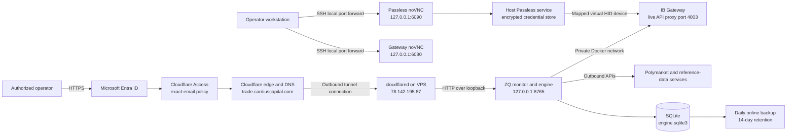

# ZQ Trading System — Current Deployment, Security and Production Readiness

Documentation and production runtime reviewed: 2026-09-22 at 16:26 UTC / September 23 at 00:26 Taipei

Environment: margin-preview fix deployed / October ledger preserved / Gateway connected / engine disarmed and unpaused / clean October reconciliation

Active VPS: **78.142.195.87** (`s62219`)

Public monitor: <https://trade.cardiuscapital.com>

This is the single maintained deployment, security, and production-readiness record. It consolidates the September 8 migration, the September 10 **Review VPS production readiness** task and its implementation follow-up, the September 11–12 validation records, and the September 14 Passless recovery and authorized production restart. [Section 11](#11-production-readiness-findings-and-evidence) distinguishes implemented fixes, accepted deferrals, and outstanding evidence; [Section 12](#12-release-acceptance-and-recovery-procedure) contains the combined acceptance procedure.

Runtime status is a dated observation, not a continuously updated monitor. Cloudflare and Entra administrative settings were not re-audited during the passkey work. Consolidating this record does not rerun the historical tests, certify unattended operation, or change production configuration.

For routine Gateway login and desktop access, use [IBKR_GATEWAY_PASSLESS.md](IBKR_GATEWAY_PASSLESS.md). Passless and port 6090 start as VPS system services; workstation access still requires an SSH tunnel, and fresh authentication can require manual unlock and approval.

Local toolchain, native dependency installation, and nonsynchronized runtime paths are covered in [macOS development](../docs/local-development-macos.md). The September 23 margin-preview update below was applied after the owner pushed the release and authorized deployment.

## 1. Executive Summary

The current design separates source control, artifact creation, host configuration, runtime data, and public access.

GitHub is the source and build system. A push to `main` runs validation and creates a container image in GitHub Container Registry (GHCR). The VPS is not automatically changed by that workflow. A specific, immutable image digest must be promoted to the VPS with the deployment script.

The VPS runs the trading engine, the IB Gateway, Cloudflare Tunnel, and local SQLite storage. The application listens only on the VPS loopback interface. Cloudflare Tunnel makes the monitor reachable at `trade.cardiuscapital.com` without opening an application port to the Internet. Cloudflare Access requires Microsoft Entra authentication and authorizes only `leo_ying@lucentti.com`. The application then requires its own dashboard username and password, creating a second authentication layer.

Historical September 14 verification: the callback deadline fix in `0c4718e` was deployed on September 14 at 13:15 UTC after the operator explicitly approved disarming and cancelling the working unfilled ZQ order. At 13:17 UTC, the updated engine was healthy, disarmed, unpaused and idle, with clean venue-ledger reconciliation, matching positions, no outstanding hedge obligations, and a qualified 5-contract margin preview. Its configured mode remains `LIVE_ARMED`; `LIVE_TRADING_ENABLED`, `POLYMARKET_ORDER_SUBMISSION_ENABLED`, and `IBKR_ORDER_SUBMISSION_ENABLED` are unchanged. Gateway remains logged into live mode with `READ_ONLY_API=no`. No re-arm action was sent during this deployment. The earlier morning arming is recorded as historical evidence in Section 11.1.

### September 23 current deployment

Release `00d9368b61373ad66f5ba4efa8e14d6b0b0664b8` is deployed using immutable image
`ghcr.io/yzy0806/poly-zq-trading@sha256:1dc2488685aa0d631c65e0781bf5687ad9e378ff88cf15799f02aaafbad724a0`.
[GitHub Actions](https://github.com/yzy0806/Poly-ZQ-trading/actions/runs/35753060635) passed
Ubuntu validation, macOS validation and image publication. The owner committed and pushed
this fix; Codex deployed it with explicit approval and made no commit or push. The final
container started September 22 at 16:23:37 UTC / September 23 at 00:23:37 Taipei.

The release isolates completed what-if callbacks from live-order reconciliation, preserves
preview identity across cleanup/reconnect, rejects late results for failed requests, and
finishes what-if requests locally without sending broker cancellations. The original
unexpected order 4361 was not retained in callback logs, so its identity remains unproven;
see the [investigation and 463-test validation](../docs/validation/ibkr-margin-preview-callbacks-2026-09-23.md).

Post-deployment checks passed for container health, `/healthz` and `/readyz`. The engine is
**disarmed, unpaused and idle**, with authenticated reconciliation **CLEAN**, no current
alerts, ten synchronized Polymarket books, verified October mapping and valid EFFR. Three
consecutive BUY-5 October previews at 96.10 qualified CURRENT and each produced request/finish
logs. Routine account reads temporarily entered UNKNOWN before returning CLEAN without
pausing. No event-consumer failures, callback identity conflicts or log-level errors were
observed. This is a short runtime observation, supplemented by offline delayed-callback tests.

The same `/var/lib/zq-arb/october-2026-live.sqlite3` ledger retains its completed batch and
cancelled order 4354, with zero executions, hedge obligations and opening inventory. Record
fingerprints match the pre-update backup, excluding only the routinely refreshed batch
`updated_at` timestamp. The initial timestamp-inclusive comparison caused an automatic
rollback; the sole timestamp difference was confirmed before the successful retry. The
September position and manual order were left untouched; no executable order, cancellation
or ARM command was sent by the deployment. Gateway has remained running since September 14.

Only `SOFTWARE_VERSION` and `CONFIG_VERSION` changed in the application env; credentials,
October mappings, existing risk limits and submission settings remain unchanged. Env mode
is `0600`; no manual env update is needed. The private rollback env/image reference and
integrity-checked database backups are retained in
`/opt/zq-arb/releases/00d9368b61373ad66f5ba4efa8e14d6b0b0664b8`.
See the [sanitized runtime evidence](../docs/validation/production-margin-preview-2026-09-23.json).

### September 22 previous deployment

Release `e404b1c38e582aad13f63bae3a790b352bcd95f7` was deployed using the immutable
image `ghcr.io/yzy0806/poly-zq-trading@sha256:3cdbedfb3cb8942cf76bf3280d555f8daf2b320338a30d33cebcf7b99163d575`.
[GitHub Actions](https://github.com/yzy0806/Poly-ZQ-trading/actions/runs/35746933580)
passed Ubuntu validation, macOS validation and image publication. The local backend suite
passed all 441 tests with 87.74% coverage; Ruff and MyPy passed. Runtime Python is 3.14.7;
the dashboard build uses the pinned Node 26.9.0 toolchain.

The initial October rollout used `53c2d67`. The engine targets October ZQ (`202610`, ZQV6),
Polymarket event `606422`, the October 28 statement and the configured October 29 rate-effective
date. The owner authorized a clean October database, then confirmed that the remaining
September position and manual order are intentional and must remain unchanged.
`/var/lib/zq-arb/october-2026-live.sqlite3` was bound to the October strategy identity and,
at that deployment check, contained no batches, orders, executions, hedge obligations or adopted inventory. The scope
correction reused that database; it did not reset it. The September ledger remains at
`/var/lib/zq-arb/engine.sqlite3`.

At 15:02 UTC, the first October release incorrectly reported
`unexpected_ibkr_clients: ['0:0']` for the manual September order. Its foreign-client guard
ran before contract-month classification. Release `e404b1c` excludes explicitly identified
foreign-client ZQ futures orders in other months from the October order comparison. IBKR
status callbacks inherit scope only from the exact client/order/permanent-ID combination;
manual orders sharing client/order `0:0` cannot hide one another. Current-month orders,
unidentified orders and strategy-identity conflicts retain their entry guards. Active fill
faults still pause immediately. All exposure still participates in account-wide margin and
excess-liquidity checks; see [execution safety](../docs/execution-safety.md).

At 15:29 UTC, container health, `/healthz` and `/readyz` passed, authenticated venue-ledger
reconciliation was **CLEAN**, and the engine was **disarmed, unpaused and idle**, with no
unresolved alerts. All ten Polymarket books were synchronized, the October mapping/rule hash
was verified, and current EFFR was valid. October, November and December ZQ quotes arrived.
The BUY-5 October what-if preview at 96.1 was `AVAILABLE` and qualified `CURRENT`.
No arming action was sent; passing readiness or reconciliation does not authorize trading.

Independent broker reads before and after the correction returned the same **25-contract
long September ZQU6 position** and submitted manual **SELL-27 September ZQU6 order** from
client 0. The owner-confirmed position and order were left unchanged. The October ledger
has zero trading records and venue reconciliation reports no unexplained October exposure.
No live orders were placed, modified or cancelled by the deployment.

Production credentials, secure origin/cookies, Gateway endpoint/client, existing live-mode
switches and Section 1.2 risk limits were preserved. The initial October rollout updated
maintenance/account-refresh/calendar fields and October market mappings. The scope correction
changed only `SOFTWARE_VERSION` and `CONFIG_VERSION`; all other env values were verified
unchanged, and file permissions remain `0600`. Private credentials stayed on the server.
No manual env field is currently missing.

The first October activation rolled back because Windows-origin deployment scripts lacked
Unix execute permission. Server permissions were corrected, and the three shell entrypoints
now have executable mode committed in `e404b1c`. Gateway and Passless containers/services were
left running. Local Mac Docker remains unnecessary. The immediate rollback image and env,
plus an integrity-checked October database backup, are in the root-only directory
`/opt/zq-arb/releases/e404b1c38e582aad13f63bae3a790b352bcd95f7`. Initial September rollover backups remain in the
`53c2d672f3fe89c0f5388d0c809fbad1355c3f6d` release directory.
See the [sanitized validation snapshot](../docs/validation/production-october-2026-09-22.json).

### 1.1 Active VPS and approved resource settings

| Item | Current setting |
|---|---|
| Active VPS public IP | **78.142.195.87** |
| Hostname and operating system | `s62219`, Debian 13 (trixie), amd64 |
| Host capacity | 8 vCPUs, approximately 8 GiB RAM, approximately 79 GiB root filesystem |
| SSH connection from the workstation | `ssh root@78.142.195.87` |
| ZQ engine CPU allowance | **2 CPUs**, increased from 0.75 |
| ZQ engine RAM limit | **1 GiB**, increased from 384 MiB |
| Gateway Java heap ceiling | **1,024 MiB**, increased from 512 MiB |
| Application worker count | `API_WORKERS=1` |
| Gateway mode and API setting | `TRADING_MODE=live`, `READ_ONLY_API=no` |
| Application trading controls | `RUN_MODE=LIVE_ARMED`; all three order-submission switches true; runtime arming required after engine restart |
| Gateway passkey provider | Passless 0.19.2, patched and installed as a restricted host service; attended approval desktop on loopback 6090 |
| Old VPS retained for rollback | **192.109.228.234** (`s61959`); migrated services stopped and automatic startup disabled |

The three resource increases were explicitly approved before application. The Gateway retains no Docker CPU or memory cap; its Java heap ceiling is not a limit on total container memory. Gateway API permissions and application order gates are separate controls. Live execution was enabled under the user's production authorization, with the existing ledger and risk settings preserved.

The active engine Compose file and repository copy contain `cpus: 2.0` and `mem_limit: 1g`. The September 14 Gateway recovery preserved the deployed engine artifact and production trading limits.

### 1.2 Approved production limits

These are the settings preserved during the September 14 production restart. Historical review examples and pilot proposals do not replace them.

| Setting | Production value |
|---|---|
| ZQ child order quantity | 5 contracts |
| Maximum total ZQ position | 60 contracts, including adopted opening inventory |
| Maximum open batches | 1 |
| Minimum net profit | USD 100 |
| Minimum return on capital | 100 basis points |
| Minimum margin cushion ratio | 5% |
| Minimum full excess liquidity | USD 10,000 on the VPS; the local value was USD 5,000 |
| Maximum reconciliation age | 60 seconds |
| Network execution request timeout | 10 seconds |
| Shutdown drain | 20 seconds, within the container stop grace period |
| IBKR callback settlement window | 2 seconds; not a Polymarket settlement deadline |

## 2. Configuration and Authentication

The initial VPS installation created a new `zq-arb.env` because no server configuration existed yet. The bootstrap script generated a new dashboard password, session-signing key, and control-confirmation secret. Those values are independent of the local development `.env`, the IB Gateway credentials, the IBKR account password, and the Microsoft account used by Cloudflare Access.

The dashboard therefore has two consecutive login layers:

1. Cloudflare Access authenticates the Microsoft identity and checks the allowed email address.

2. The ZQ application authenticates `DASHBOARD_USERNAME` and `DASHBOARD_PASSWORD` from the VPS copy of `zq-arb.env`.

Entering IBKR, Microsoft, or an older local dashboard credential at the second prompt will fail. The first installation creates the file only when it is absent. Normal image deployments preserve it and do not generate new application credentials.

The relevant configuration locations are:

| Purpose | VPS directory | File | Lifecycle |
|---|---|---|---|
| Application secrets and settings | `/etc/zq-arb` | `zq-arb.env` | Created once; edited only on the VPS; never committed |
| Deployed image reference | `/etc/zq-arb` | `deployment.env` | Updated atomically during promotion |
| Cloudflare Tunnel credential | `/etc/cloudflared` | `trade.token` | Stored with restrictive permissions; loaded by systemd |
| IB Gateway credentials and settings | `/opt/ib-gateway` | **`.env`** | **Edit this file on 78.142.195.87 to enter the IBKR login; mode 0600** |
| IB Gateway container definition | `/opt/ib-gateway` | `compose.production.yml` | Reads the Gateway `.env`; uses the verified local repaired image and Passless device mapping |
| Saved Gateway session and GUI settings | `/opt/ib-gateway` | `tws_settings/` | Mounted at `/home/ibgateway/tws_settings` inside Gateway |
| Passless service files and executable | `/opt/ib-passkey` | `passless`, `desktop.sh`, readiness helper | Host services; separate from the Gateway container |
| Passless encrypted key material | `/var/lib/ib-passkey` | `.gnupg/`, `.password-store/` | Restricted service account; preserve together; never commit |
| Current application database | `/var/lib/zq-arb` | `october-2026-live.sqlite3` | Fresh October ledger; September `engine.sqlite3` retained |

The Gateway `.env`, application configuration, and tunnel token were verified as root-owned files with mode `0600`. No secrets belong in GitHub commits, GitHub Actions logs, container image layers, or this document. The migration preserved the existing credentials instead of running first-install credential generation again.

### 2.1 Where to enter or change IB Gateway credentials

The live credential file is **`/opt/ib-gateway/.env` on VPS 78.142.195.87**. It is separate from the workstation project `.env` and the ZQ application file `/etc/zq-arb/zq-arb.env`. Existing Gateway credentials were migrated, so re-entry is needed only if you want to change them.

From a local macOS Terminal (zsh), connect to the active VPS:

```sh
ssh root@78.142.195.87
```

If the in-app terminal is already connected to that VPS, run `hostname` and confirm it prints `s62219`; do not open another SSH session from inside the VPS.

The enabled `ib-gateway-config.path` service watches `.env` and automatically applies saved changes. For a controlled edit, pause that watcher first, then edit the file on the VPS. `nano` is installed:

```bash
cd /opt/ib-gateway
systemctl stop ib-gateway-config.path
nano .env
```

Update the existing assignments rather than adding duplicate keys. The following values are examples only:

```dotenv
TWS_USERID='your_ibkr_username'
TWS_PASSWORD='your_ibkr_password'
TRADING_MODE=live
```

Use the credentials for the approved live IBKR account and preserve the intended environment. `VNC_SERVER_PASSWORD` in the same file controls the Gateway desktop password; it is separate from the IBKR password and the Passless storage passphrase. Preserve its existing value unless you intend to change the desktop password as well. Keep `JAVA_HEAP_SIZE=1024` and the other approved settings.

Single quotes preserve literal dollar signs in Compose values. If a credential itself contains a single quote, escape it as `\'` within the single-quoted value, following [Docker's environment-file syntax](https://docs.docker.com/compose/how-tos/environment-variables/variable-interpolation/#env-file-syntax).

In nano, save with **Ctrl+O**, press **Enter**, then exit with **Ctrl+X**. Validate and apply the saved file, then resume the watcher:

```bash
chmod 600 .env
docker compose -f compose.production.yml config --quiet && \
  systemctl start ib-gateway-apply.service && \
  systemctl start ib-gateway-config.path
```

If validation or application fails, correct the file and rerun this command; the watcher stays paused until those steps succeed. The apply service starts Passless, resolves its HID device and group, checks the verified repaired image, and applies Compose without pulling an upstream image. A changed credential causes Gateway to be recreated and to log in again, disconnecting its API until authentication completes. A plain `docker restart` does not load changed Compose environment values.

Check the service and Gateway status:

```bash
systemctl status ib-gateway-apply.service ib-gateway-config.path --no-pager
docker ps --filter name=ib-gateway
```

The apply unit is a one-shot service: `inactive (dead)` after a successful exit can be normal; the config watcher should be active. Open both desktops as described in Section 7 and complete Passless unlock or approval if requested. If the engine exhausts its reconnect attempts, follow the [trading recovery procedure](IBKR_GATEWAY_PASSLESS.md#trading-recovery-after-login), including inspecting active orders before an engine restart. Do not change account identity or trading limits as part of a credential update.

### 2.2 Account selection required for margin previews

Gateway login and the application's account selection are separate settings. `TWS_USERID` and `TWS_PASSWORD` belong in the Gateway `.env`. **`IBKR_ACCOUNT_ID` belongs in `/etc/zq-arb/zq-arb.env` on 78.142.195.87**, and must identify the approved live account rather than the login username. The execution database is bound to its account/environment and wallet identity; do not repurpose it for another account.

The September 8 staging diagnosis found a blank account ID and a `NOT_REQUESTED` margin preview. That historical state is superseded: on September 14 the saved production identities matched the intended configuration, and an actual current IBKR margin preview completed for quantity 5. Its estimated next-batch initial margin was USD 1,363.66 at the recorded verification; this is a dated result, not a fixed requirement for future orders.

For an authorized account-setting correction, use Section 5.3 to load the saved environment. The preview path sets `whatIf=True` independently of execution switches. A connected Gateway and working quotes do not replace account validation, a current margin preview, or authenticated venue reconciliation.

## 3. Current Architecture



The important trust boundaries are:

1. Cloudflare handles Internet-facing TLS, identity authentication, and the public hostname.

2. The Cloudflare Tunnel connector initiates an outbound connection from the VPS. The application does not need a publicly routable port 8765.

3. The application performs its own authenticated session check after Cloudflare Access.

4. The engine communicates with IB Gateway over a private Docker network, not through the public monitor hostname.

5. Persistent state and secrets live outside the application image, so deploying a new image does not replace them.

## 4. Work Completed in GitHub

### 4.1 Repository and release workflow

The deployment workflow is defined in `container.yml`. It runs for pull requests, pushes to `main`, and manual workflow dispatches.

The September 21 repository update aligns native Mac development and the Ubuntu production build on Python 3.14.7, Node 26.9.0 and uv 0.12.17. CI reads `.python-version` and `.node-version` for both Ubuntu and macOS, installs the locked dependencies, and runs Ruff, MyPy, the backend suite with the coverage gate, dashboard lint/tests and the dashboard build. The Dockerfile pins the same runtime versions. The matching release passed all three jobs and was deployed on September 22; see the current deployment above.

For non-pull-request runs, GitHub Actions builds and publishes the application container to GHCR. The workflow uses Docker Buildx caching and emits provenance and an SBOM. Third-party GitHub Actions are pinned to full commit hashes. The workflow uses the repository-scoped `GITHUB_TOKEN`; read permission is the default, while package, attestation, and identity-token writes are limited to the image-publishing job.

The image receives traceable tags, including the Git commit and a mutable staging label. The VPS deployment path does not accept a tag as the final release reference. It requires the immutable `@sha256:` digest, preventing a later tag move from silently changing what is deployed.

### 4.2 Current artifact and rollback history

The current artifact is the September 22 `e404b1c` image recorded above. Its immediate rollback image is `53c2d67` with digest `sha256:4f550338f00f47921ef25b2675569111360d06dc7c1a1b6bfea9ec268062bf81`, using the saved prior env and the same October database. That image retains the September foreign-order block. The older `0c4718e` image below belongs to the September configuration and requires its corresponding env/database identity.

The previous production engine artifact deployed on September 14 at 13:15 UTC was built from Git commit `0c4718e605950e97fa0c3660f1b9760899833897`. [GitHub validation and publishing](https://github.com/yzy0806/Poly-ZQ-trading/actions/runs/34846383394) passed. The packaged coordinator, repository, and state source matched the inspected checkout; the coordinator also imported successfully in an isolated container without network access. Its immutable deployed reference is:

```text
ghcr.io/yzy0806/poly-zq-trading@sha256:8b4ee4929fa331a49d6ae287a189819d0ef10f2adfcfa323c7d7d244fdbb34ea
```

The previous engine artifact, commit `710c55bb5ab6d97363b219bfc734a2cd3b3ed0b4` at `ghcr.io/yzy0806/poly-zq-trading@sha256:d40166d4e2149571712d66ac5ac7f394ffc363463f0e12255451da3446354176`, is preserved as the rollback reference. The final drained database backup is `/var/backups/zq-arb/drained-0c4718e-20260914T131515Z.sqlite3`; integrity and foreign-key checks passed. The protected release record is under `/opt/zq-arb/releases/0c4718e605950e97fa0c3660f1b9760899833897`. Production configuration and Compose contents were unchanged, and the Gateway container was not restarted.

Gateway uses the locally repaired image `local/ib-gateway:jxbrowser-fix-20260914`, image ID `sha256:3e7f26494a26f74a024126754625d647508ad29a56fa6be739b5d379129694cf`. It contains Gateway 10.45.1j and the bundled x86 JxBrowser 8.9.4 JARs with the runtime repair. The production apply script verifies this image ID and uses `--pull never`.

The September 8 migration previously used application commit `c12a018` and digest `sha256:3a383258bd5995de00338f70c2f2bbffb0364b7f62362183ace7efb89a5d44c4`; that is historical, not the current release. The repaired Gateway derives from the previously pinned upstream image `ghcr.io/gnzsnz/ib-gateway@sha256:91165c0752ca534c0dad3c40683ae7c2745974d4d277651a90e90411ca609d8d`. Docker Engine 29.8.0, Compose 5.5.1, and cloudflared 2026.8.3 were observed during the September 8 migration.

### 4.3 What GitHub does not currently do

GitHub Actions does not SSH into the VPS and does not automatically replace the running container. A successful build creates a candidate artifact; a separate operator-controlled promotion selects the exact digest.

The recommended day-to-day code path is therefore:

1. Develop and test on the workstation.

2. Commit and push the change to GitHub.

3. Wait for all GitHub Actions validation and image-publishing jobs to pass.

4. Record the published immutable image digest.

5. Promote that digest on the VPS.

6. Verify health, readiness, dashboard state, venue connectivity, and logs before treating the release as accepted.

There is normally no reason to `git pull` application source onto the production VPS. The deployable unit is the tested container image. The VPS needs only the deployment scaffold, server-only configuration, runtime data, and access to the approved GHCR image.

## 5. VPS Deployment Process

### 5.1 Initial host installation

`install_vps.sh` creates the application, configuration, data, and backup directories; installs the deployment compose file and systemd services; checks for the external `ib-gateway_default` Docker network; and creates `zq-arb.env` only if it does not already exist.

`bootstrap_env.py` refuses to overwrite an existing target. On first installation it generates independent high-entropy values for `DASHBOARD_PASSWORD`, `SESSION_SIGNING_KEY`, and `CONTROL_CONFIRMATION_SECRET` and applies restrictive file permissions. This one-time behavior was the source of the credential mismatch discussed in Section 2, but it also prevents an update from destroying established secrets.

For the September 8 migration, the existing deployment files and credentials were copied to **78.142.195.87** over encrypted SSH streams. The source engine and Gateway were stopped before the final data transfer; the existing SQLite data, backups, and Gateway settings were preserved. Database integrity and a new destination backup were verified. All VPS commands in this section refer to the active host, not the retired source.

### 5.2 Image promotion

`update_vps.sh` requires root privileges and accepts exactly one image reference in the form `ghcr.io/...@sha256:<64 hexadecimal characters>`. It writes the image reference to `deployment.env` atomically, pulls the exact artifact, recreates the application container, and waits up to 90 seconds for the health check. If health fails, it prints recent container logs and exits with an error.

A normal promotion is performed from the application directory:

```bash
cd /opt/zq-arb
sudo deploy/update_vps.sh 'ghcr.io/yzy0806/poly-zq-trading@sha256:REPLACE_WITH_APPROVED_DIGEST'
```

The same command with the previously accepted digest is the rollback procedure. Because configuration and SQLite data are mounted outside the image, rolling the application image backward does not automatically roll back the database schema or server settings. Any future schema migration must therefore include an explicit compatibility and rollback plan.

### 5.3 Configuration changes

Run the following commands on **78.142.195.87** after connecting with `ssh root@78.142.195.87`. Configuration changes are separate from image deployment. To edit the application environment:

```bash
cd /etc/zq-arb
sudoedit zq-arb.env
```

**Saving `zq-arb.env` does not apply the change automatically.** This application file has no automatic config watcher. A plain `docker restart zq-arb-engine` keeps the container's existing environment. After saving an application setting such as `IBKR_ACCOUNT_ID`, validate the Compose configuration and **recreate the engine container**:

```bash
sudo docker compose --env-file /etc/zq-arb/deployment.env \
  -f /opt/zq-arb/deploy/compose.production.yml config --quiet && \
sudo docker compose --env-file /etc/zq-arb/deployment.env \
  -f /opt/zq-arb/deploy/compose.production.yml \
  up -d --no-deps --force-recreate --pull never engine
```

This briefly interrupts the dashboard and engine connections. It uses the already-installed image digest, reloads the saved environment, and retains the mounted database. Gateway and Cloudflare Tunnel continue running. If validation fails, correct the file before retrying. Keep the configuration mode `0600` and preserve the approved account, trading limits, and execution settings. The recreated engine starts disarmed even when configured as `LIVE_ARMED`; require fresh reconciliation and margin checks before authorized arming. First-install bootstrap defaults remain `READ_ONLY` with submission switches false.

After the engine has started, check process health and the loaded safety settings:

```bash
sudo docker ps --filter name=zq-arb-engine
curl --fail --max-time 5 http://127.0.0.1:8765/healthz
sudo docker exec zq-arb-engine printenv RUN_MODE \
  LIVE_TRADING_ENABLED POLYMARKET_ORDER_SUBMISSION_ENABLED IBKR_ORDER_SUBMISSION_ENABLED
```

For an account-ID edit, verify that a nonempty value reached the running container without printing the identifier:

```bash
sudo docker exec zq-arb-engine python -c "import os; print('IBKR_ACCOUNT_ID nonempty:', bool(os.environ.get('IBKR_ACCOUNT_ID', '').strip()))"
```

`True` confirms a value was loaded; it does not validate that the account is correct or authorized. Once Gateway connectivity and a valid live ZQ subscription are available, check that the dashboard margin preview progresses to `CURRENT`, or inspect the displayed preview error. The preview loop is paced at a minimum 60-second interval between requests. The public `/readyz` endpoint does not include all margin prerequisites and can still return HTTP 503 for the separate geographic-eligibility block.

Gateway credential changes use a different mechanism: `/opt/ib-gateway/.env` is watched by `ib-gateway-config.path`; follow Section 2.1 for controlled editing and application. The application configuration file should not be copied back to the workstation or GitHub. The repository file `zq-arb.env.example` is a non-secret template, not the live configuration.

### 5.4 Container hardening

`compose.production.yml` gives the application a read-only root filesystem, a restricted temporary filesystem, no Linux capabilities, no privilege escalation, an init process, PID, memory, and CPU limits, a loopback-only HTTP binding, a health check, and bounded log rotation. The application joins an internal network and the existing IB Gateway Docker network.

The engine has a **2-CPU allowance and 1-GiB RAM limit**, a 256-process limit, and one application worker. These are the current approved values, replacing the original 0.75-CPU/384-MiB limits. Its restart policy is `unless-stopped`. Persistent files are mounted from `/var/lib/zq-arb`; replacing the container does not replace this directory.

### 5.5 Reboot behavior and old-host standby

Docker, `cloudflared-trade.service`, `ib-gateway-novnc.service`, `ib-gateway-config.path`, and `zq-arb-backup.timer` are enabled on the active VPS. Both application containers use `restart: unless-stopped`.

Passless runs outside Docker as four enabled host services: `ib-passkey-display.service`, `ib-passkey-desktop.service`, `ib-passkey.service`, and `ib-passkey-novnc.service`. All four were verified active. The enabled `ib-gateway-apply.service` depends on Passless; the desktop readiness check prevents the authenticator starting before its session is available. A normal Gateway restart does not require manually starting Passless or port 6090.

These settings configure startup, not unattended authentication. A fresh IBKR login can still require the storage passphrase and approval on 6090, and an engine restart leaves trading disarmed. Full VPS reboot recovery and daily/weekly login behavior have not been tested. The workstation SSH forwards must be recreated after their connection ends or the Mac restarts or loses its connection during sleep. See [the Passless runbook](IBKR_GATEWAY_PASSLESS.md).

On **192.109.228.234**, both containers are stopped with restart policy `no`; the tunnel, Gateway config watcher, noVNC, and backup timer are disabled. The host and data remain available for rollback. Before restoring the old services, stop the destination services and preserve and assess the destination database changes. Do not start both deployments with the same Gateway credentials or expose two independent application databases through the same tunnel.

## 6. Work Completed in Cloudflare

### 6.1 Public hostname and tunnel

The Cloudflare-managed zone is `cardiuscapital.com`. A named tunnel, `zq-trade-vps`, serves `trade.cardiuscapital.com` and forwards requests to `http://127.0.0.1:8765` on the VPS.

The `cloudflared` connector is installed as a hardened systemd service. It runs with a dynamic service identity, reads the tunnel token through a systemd credential instead of exposing it on the command line, disables in-process auto-update, restarts on failure, and applies filesystem, device, kernel, syscall, and privilege restrictions.

The active connector now runs on **78.142.195.87**. Migration reused the existing tunnel token and stopped the old connector before starting the new one; no Cloudflare login, DNS edit, or Access-policy change was needed. Four tunnel connections were ready after cutover. An unauthenticated public request returned HTTP 302 to the existing `lucentti.cloudflareaccess.com` login.

This design means Nginx is not currently installed or required for the monitor. Cloudflare terminates public HTTPS, and the tunnel forwards to the loopback-only application service. Nginx would add another component without providing a necessary trust boundary in the present single-service design.

### 6.2 Cloudflare Access application

The self-hosted Access application is named `ZQ Trading Monitor`. Its hostname is `trade.cardiuscapital.com`, its Access session duration is six hours, and its allow policy is restricted to the exact email address `leo_ying@lucentti.com`.

Microsoft Entra ID is the recorded login method. The initial Entra integration failed because its client secret had expired. The Entra/Cloudflare integration was corrected, and a complete external login was verified during the original September 4 setup. That authenticated flow was not repeated during the September 8 migration. The recorded authorization policy is based on the exact email address and does not depend on Entra group membership.

The Entra application has the standard OpenID/profile permissions plus the Microsoft Graph permissions used by Cloudflare's Entra integration. Administrative consent was granted. PKCE was enabled during the configuration review. SCIM provisioning and Entra policy synchronization are not part of the current design.

The Access layer and application layer are intentionally separate. Passing Microsoft login proves that the request is from the authorized organizational identity. Passing the ZQ dashboard login creates the application session and gates application controls. The Cloudflare session is six hours; the application session is configured for up to eight hours, so either layer can require reauthentication independently.

### 6.3 Origin isolation

The application binds to `127.0.0.1:8765`. A remote Internet host cannot directly reach that socket. The only public path is Cloudflare's edge followed by the outbound tunnel. This substantially limits origin-bypass risk even before considering the application login.

Cloudflare recommends validating Access tokens at the origin, either with the tunnel's Access protection setting or inside the application. Loopback binding and the application login provide meaningful defense in depth, but confirmation of explicit origin-side Access JWT validation remains a hardening item before live trading.

## 7. Current Network Exposure

| Service | Listener or path | Intended exposure | Protection |
|---|---|---|---|
| Trading monitor | `127.0.0.1:8765` | Public only through Cloudflare | Access exact-email policy plus application login |
| Application Prometheus metrics | **Not listening** on port `9108` | Configured intent only; not an operational endpoint | Instrumentation remains incomplete |
| Cloudflared connector metrics/readiness | `127.0.0.1:20241` observed after migration | VPS-local only; selected port can change after restart | Loopback binding |
| IB Gateway live API | Engine uses `ib-gateway:4003`; host `127.0.0.1:4001` maps to container `4003` | Proxy connects to Gateway's trusted container-loopback API port `4001` | Private Docker networking and host loopback binding |
| Reserved Gateway paper mapping | Host `127.0.0.1:4002` to container `4004` | Mapping retained; no paper session is claimed in the live deployment | Loopback binding |
| IB Gateway VNC | `127.0.0.1:5900` | noVNC or approved SSH forwarding only | VNC password and loopback binding |
| IB Gateway noVNC | `127.0.0.1:6080` | Workstation through SSH forwarding only | SSH authentication and loopback binding |
| Passless approval VNC | `127.0.0.1:5901` | Local noVNC backend only | Loopback binding; no separate VNC password on this desktop |
| Passless approval noVNC | `127.0.0.1:6090` | Workstation through SSH forwarding only | SSH authentication; encrypted credential store and per-login approval |
| SQLite database | Local filesystem | Application and privileged host operators only | Unix permissions, container mount, backups |
| SSH | Host SSH service | Administrative access only | Host SSH policy; firewall and key policy should be periodically audited |

The Gateway and Passless desktops are not published at `trade.cardiuscapital.com`. From a **local macOS Terminal (zsh)**, with both local ports free, create SSH forwards to the active VPS:

```sh
ssh -N -o ExitOnForwardFailure=yes -o ServerAliveInterval=30 -L 127.0.0.1:6080:127.0.0.1:6080 -L 127.0.0.1:6090:127.0.0.1:6090 root@78.142.195.87
```

Keep that connection running, then open both desktops:

```text
http://127.0.0.1:6080/vnc.html?autoconnect=true&resize=scale
http://127.0.0.1:6090/vnc.html?autoconnect=true&resize=scale
```

Enter `VNC_SERVER_PASSWORD` from the Gateway `.env` only at the Gateway VNC prompt on 6080. A GPG prompt for **IBKR VPS Authenticator** on 6090 requires the separate user-created Passless storage passphrase. Gateway's generic “insert security key” screen can be waiting for that unlock or approval; the virtual device is already attached.

Reuse existing forwards rather than starting duplicates. Reopen them after the SSH connection ends or the Mac restarts or loses its connection during sleep. This is workstation connectivity, not a Passless startup command: the VPS services run independently of the Mac terminal and browser. The [Passless runbook](IBKR_GATEWAY_PASSLESS.md#access-from-macos) includes a 6090-only command when the Gateway forward already exists.

## 8. Database and Backup Design

The system uses SQLite. No PostgreSQL, MySQL, or other database server is installed or required for the current single-engine deployment. The durable database is `engine.sqlite3` in `/var/lib/zq-arb`.

The backup job uses SQLite's online backup mechanism and runs an integrity check on the result. Backups are stored under `/var/backups/zq-arb`, receive restrictive permissions, and are retained for 14 days.

The database and prior backup history were transferred to 78.142.195.87 after stopping the old writers. Post-transfer integrity was `ok`, and the destination backup service completed with `Result=success` and `ExecMainStatus=0`. Subsequent non-sensitive verification also confirmed the successful backup result.

The systemd backup timer runs daily at 16:20 in the `America/Chicago` time zone, with up to two minutes of randomized delay. Using the exchange-local time zone keeps the schedule aligned through daylight-saving changes.

The present backup is local to the same VPS. It protects against application-level corruption and accidental file loss, but not total VPS or provider loss. An encrypted off-host backup target is still required for disaster recovery.

The September 14 Gateway promotion also saved a private backup at `/opt/ib-passkey/production-backup-20260914T073953Z`, including the prior Gateway configuration, a consistent SQLite backup, and an archive of the protected Passless store. The routine SQLite timer does not back up Passless key material. Preserve its GPG key and encrypted password store together when preparing host recovery; the temporary registration service is not needed for ordinary login.

Execution databases bind themselves to the IBKR environment/account/client and Polymarket simulation/wallet/API-owner identity. Keep one engine writer per ledger and use separate databases for incompatible identities. An older ledger containing clipped fills or missing provenance cannot be relabelled as live data: preserve it and reconstruct from venue evidence. The existing production ledger has already completed its handoff; do not repeat the historical empty-ledger adoption. Detailed invariants and the exceptional transition procedure remain in [execution-safety.md](../docs/execution-safety.md) and [OPENING_INVENTORY.md](../docs/OPENING_INVENTORY.md).

## 9. IB Gateway Restart and Trading Impact

IB Gateway is configured for an automatic daily restart at 16:10 `America/Chicago`, within the CME daily maintenance interval. Scheduling in `America/Chicago` keeps the restart consistent with CME local market time across daylight-saving transitions.

During the restart, the IBKR API socket disconnects. The engine should mark IBKR unready, prevent new IBKR-dependent execution, and reconnect after the gateway returns. Open orders already resting at IBKR are managed by IBKR during the client disconnect, but local monitoring and modification are temporarily unavailable. The engine must reconcile positions, orders, executions, and market-data subscriptions after reconnection before trading can resume.

Passless and its port-6090 desktop remain running as host services when only the Gateway container restarts. No manual start command is normally needed. If Gateway requires fresh passkey authentication, open 6090, unlock the encrypted store if prompted, and approve the request. An already-unlocked store may skip the passphrase step. Automatic service startup does not guarantee unattended authentication or completion of the daily restart.

If login takes long enough to exhaust the engine's reconnect attempts, complete Gateway login first, then follow the [trading recovery procedure](IBKR_GATEWAY_PASSLESS.md#trading-recovery-after-login). Inspect outstanding orders before restarting an engine, allow its shutdown drain, and obtain fresh reconciliation and margin checks before authorized arming. Every engine restart starts disarmed. An attended Gateway login and production restart were verified on September 14; scheduled daily/weekly recovery and a full VPS reboot remain untested.

The database backup follows at 16:20, after the planned gateway restart. Any strategy expected to operate across the maintenance interval must treat the disconnect as a scheduled risk event rather than an exceptional transient failure.

## 10. Security Controls by Layer

| Layer | Current control | Security purpose |
|---|---|---|
| Source | GitHub repository with reviewed commits | Traceability and change history |
| CI | Locked dependencies, lint, type checks, tests, dashboard build | Reject invalid artifacts before publication |
| Supply chain | SHA-pinned actions, GHCR digest, provenance, SBOM | Reduce dependency and image-substitution risk |
| Promotion | Manual immutable-digest deployment | Separate build success from release approval |
| Secrets | VPS-only environment files, restrictive permissions | Keep credentials out of source and image layers |
| Internet edge | Cloudflare DNS, TLS, Access | Authenticate and authorize before origin access |
| Origin | Outbound tunnel and loopback listener | Prevent direct application-port exposure |
| Application | Independent dashboard login, secure cookies, CORS restriction | Second authentication and session boundary |
| Runtime | Read-only filesystem, dropped capabilities, resource limits | Limit container compromise impact |
| Trading | Explicit arming, venue-specific order gates, authenticated reconciliation, margin and risk limits | Require verified state before production execution; engine restarts start disarmed |
| Data | Persistent SQLite, online integrity-checked backups | Preserve state across deployments and support recovery |
| Operator GUI | SSH-forwarded Gateway 6080 and Passless 6090; separate host services | Avoid public remote-desktop exposure while supporting attended login |

## 11. Production Readiness, Findings and Evidence

The September 10 review assessed local revision `b25c72a` and advised against unattended live trading at that revision. The same task subsequently implemented the agreed execution fixes. Later validation and the September 14 production restart supersede several initial findings. A successful attended startup does not establish that every failure scenario or unattended operating requirement has been verified.

### 11.1 Last verified production observation

| Observation | Evidence at 13:17:03 UTC / 21:17:03 Taipei, September 14 |
|---|---|
| Release | `0c4718e`; callback timer fix verified in the running container |
| Engine | `armed=false`, `paused=false`, `kill_switch=false`; health and readiness HTTP 200; zero container restarts |
| Venue state | IBKR and Polymarket connected; fresh reconciliation CLEAN; all portfolio positions reconciled |
| Orders and hedges | Active batch IDLE; zero unresolved hedge obligations; working order cancellation confirmed before shutdown |
| Margin | AVAILABLE, quantity 5, qualified for the next batch |
| Event processing | Consumer running, empty queue, no failed events and no unresolved alerts |
| Configuration | Preserved; callback deadline 2 seconds and execution/account-refresh timeout 10 seconds |
| Activation | Left disarmed under the operator's explicit deployment approval; no ARM action sent |

Shutdown reconciled before promotion and a final consistent backup passed integrity checks. These observations validate startup and reconciliation, not a new live-fill exercise under the updated code. The state field `polymarket.authenticated` is overwritten by public market events in `state.py`; authenticated account reconciliation and successful venue evidence, rather than that transient display field alone, establish the account-read result.

The following morning observation is historical and predates the callback-fix deployment:

| Observation | Evidence at 08:04:44 UTC / 16:04:44 Taipei, September 14 |
|---|---|
| Engine | `armed=true`, `paused=false`, `kill_switch=false`; health `ok`, readiness true |
| Venue state | Both venues connected; fresh `AUTHENTICATED_VENUE_LEDGER` reconciliation was CLEAN |
| Positions | 25 September ZQ contracts; 12,153.8957 INC25 YES shares; 24,307.5 INC50PLUS YES shares; all matched the ledger |
| Margin | Current actual preview for quantity 5; estimated next-batch initial margin USD 1,363.66 |
| New execution | After arming, a 5-contract ZQ order at limit 96.2675 was submitted; zero filled and five remaining at the observation |
| Event processing | Empty queue, no failed events or IBKR ingress overflow, healthy container |
| Alerts | No critical alert; a non-critical IBKR 2119 connecting notice remained in history while current quotes and Gateway's connected data-farm panel were verified |
| Single writer | Local workstation engine stopped; VPS engine active |

The engine was armed at 08:03:44 UTC after current reconciliation, positions, margin, and safety checks passed. The configured limits are recorded once in Section 1.2. These snapshots do not authorize reliance on cached reconciliation after restart, prove subsequent fills, or constitute peak-load certification.

### 11.2 Execution findings and disposition

| Finding from the review | Recorded disposition | Remaining boundary |
|---|---|---|
| Lost order responses could produce another signed hedge; excess fills were clipped; reconciliation omitted inventory/order differences | **Implemented as one coordinated ledger change.** Persist the signed payload and stable order identity before POST; retain reservations for unknown outcomes; preserve full fills and cost; track allocated, pending, and excess quantities; compare both venues' inventory, orders, and executions. Offline regressions and later production startup reconciliation passed. | A timeout, 404, cancellation acknowledgement, or absence from open orders cannot alone authorize replacement. Live VPS fault-injection evidence is separate from normal startup evidence. |
| Halt could leave a profitable resting ZQ order working; shutdown disconnected too early | **Implemented.** Halt blocks new entries and requests cancellation independently of profitability or slow hedge requests. Late fills remain processed and existing permitted hedge obligations remain managed. Shutdown drains for a bounded period and records unresolved state. | Forced termination cannot guarantee venue cancellation. Filled ZQ is not automatically liquidated; the strategy remains BUY-only. |
| Unsigned/simulated saved intent could receive simulated credit in live mode | **Implemented.** Live execution rejects unsigned/simulated records; database identity is checked before replay; incompatible venue/account/wallet modes require separate ledgers. | Legacy clipped or unproven history requires reconstruction, not relabelling. Opening inventory is a separately evidenced balance, not fabricated fills. |
| September 10 local live switches were combined with paper IBKR configuration | **Historical mismatch superseded for the VPS.** September 14 verified the intended live identities, valid settings, approved gates and limits, and fresh venue evidence. Documentation now distinguishes bootstrap READ_ONLY defaults from runtime disarmed startup. | Validate every future deployment's actual environment; copying a local `.env` is not acceptance. |
| September 12 real IBKR callback used a masked account label where the ledger expected a hash | **Fixed in the successor release.** The callback bridge and execution ledger share normalized SHA-256 account identity; regression tests include duplicate replay and a different account with the same final four digits. The verified `710c55b` production artifact reached CLEAN. | No purge, account-identity rewrite, or reconciliation override was required. This execution-identity repair does not fix account-summary aggregation below. |
| IBKR account-summary values can mix accounts or currencies | **Explicitly deferred by the user under the single-account constraint.** Current source still stores values by metric tag. | Revisit before adding accounts/advisor structures, and verify that risk inputs belong to the intended account and currency. The single-account assumption is not a general multi-account guarantee. |
| Polymarket order-heartbeat cadence/protocol may lack sufficient timing margin | **Assigned to separate analysis; not closed by this record.** The agreed ledger work left heartbeat code unchanged. Current source sends the HTTP order heartbeat and then waits `POLYMARKET_USER_WS_PING_SECONDS`; this setting is not merely a WebSocket ping. | The original review questioned cadence, endpoint compatibility, returned/expired heartbeat IDs, and lapse recovery. Obtain the separate analysis and deployed timing/response evidence before treating the finding as resolved; absence of a current alert is insufficient. |

The first ledger row combines three related findings without dropping their distinct invariants. For implementation details and regression scope, use [execution-safety.md](../docs/execution-safety.md). The later IBKR callback convergence behavior is documented in [ibkr-callback-reconciliation.md](../docs/validation/ibkr-callback-reconciliation.md): known out-of-order callbacks can temporarily yield UNKNOWN, but unexplained or overdue differences must retain the safety response.

### 11.3 Outstanding operational and security evidence

This is the combined action register from the deployment record and readiness review. An item is not marked complete merely because a configuration flag exists or the engine is currently connected. Items not re-audited remain evidence gaps, rather than newly asserted incidents.

| Item | Recorded status and completion evidence required |
|---|---|
| External critical alerts and task supervision | External paging was deferred in the original design; delivered critical alerts and an independent liveness/exposure monitor are not demonstrated here. Prove notification for a dead/stalled trading task, stale venue data, unresolved order/hedge exposure, margin deterioration, or storage failure. The authenticated event diagnostics used on September 14 provide local evidence, not external delivery. |
| Dashboard freshness and metrics | The reviewed dashboard silently retries socket/HTTP reads; a prominent last-update/stale-state warning remains a review item. Application port 9108 refused connections in the earlier check. Reverify actual instrumentation; `PROMETHEUS_ENABLED` and cloudflared's connector metrics do not prove application observability. |
| Off-host backup and restore | Local SQLite backups and a protected Passless snapshot exist (Section 8). Encrypted versioned off-host copies, a demonstrated restore, and agreed recovery-point/recovery-time objectives are not recorded. Include the ledger, configuration, required authenticator key material, and evidence for unresolved venue state. |
| Failure and capacity exercises | Attended Gateway login and production reconnection passed. Full host reboot, scheduled daily/weekly passkey recovery, sustained load on the 2-CPU/1-GiB engine, disk stalls, venue loss, and detection/containment without an open browser remain unproven. Use the acceptance matrix in Section 12. |
| Release and schema discipline | Preserve commit/digest, validation evidence, prior configuration and backup references, and schema compatibility before promotion. `update_vps.sh` verifies health but cannot establish all execution prerequisites. Formal versioned migrations and their rollback procedure remain a review item; additive schema compatibility alone is insufficient. |
| Dependency advisories and test scope | The September 10 scan reported advisories for `protobuf==5.29.5` and development dependency `pytest==8.4.2`; both versions remain in the current lockfile. Preserve the [protobuf advisory](https://github.com/advisories/GHSA-7gcm-g887-7qv7) and [pytest advisory](https://github.com/advisories/GHSA-6w46-j5rx-g56g) as review references, assess applicability, and validate compatible remediation. Application-specific exploitability and a new vulnerability scan are not established by this consolidation. CI types `src`; the earlier 28 test-file typing errors were outside that gate and have no closure evidence here. |
| Financial model and capital acceptance | Document the accepted basis/tail exposure and fund IBKR margin and Polymarket hedge collateral separately. Section 11.5 preserves the original sensitivity examples; production startup and clean accounting do not establish a model-risk limit. |
| Dashboard login rate limiting | The original audit identified failure counts keyed by `request.client.host`, which can aggregate users behind one proxy. Review trusted client identity/proxy handling before broadening access, with a regression test for shared lockout. |
| Credential lifecycle | The original setup recorded a potentially exposed GitHub token; revocation was not reverified in this work. Retain narrow package-read permissions for pull credentials. Record an owner, expiry, and renewal alert for the Entra client secret and verify the external login after rotation. |
| Origin and host hardening | Explicit origin-side Access JWT validation, firewall/SSH policy, patch status, and intrusion protection require their own verified audit. Existing loopback isolation and dashboard login remain documented controls; they are not evidence that every host-hardening item is complete. |
| Failover topology | Keep the old host stopped as described in Section 5.5. A second Cloudflare connector backed by an independent writable SQLite database is not safe failover; any restoration must preserve destination changes and enforce one authoritative writer. |

The narrower September 8 verification scope, including a denied private dashboard read, was superseded by authorized authenticated runtime checks on September 14. That later access does not imply that the retained security, disaster-recovery, or unattended-operation items above were audited.

### 11.4 Dated validation and handoff evidence

| Date and scope | Recorded results | Interpretation |
|---|---|---|
| September 8 migration | Database integrity and destination backup passed; paper Gateway/API and tunnel were checked. A roughly 30-second health sample had 18 successes and two three-second timeouts; successful requests ranged from 8.44 to 2,753.11 ms, with about 1.04 cores average use and 1% quota throttling. | Historical migration/performance observations, not current runtime status or a controlled comparison. |
| September 10 initial review, `b25c72a` | Python 3.13: 216 passed. Fresh locked Python 3.12: 215 passed, one timestamp-sensitive callback test failed again in isolation. Coverage about 81.7% against 85%. Source lint/types passed; typing source plus tests exposed 28 errors in six test files. Dashboard lint, 14 tests and build passed; the npm scan reported no known findings then. | Baseline before the agreed fixes; do not present the initial failures as the result of the later release. |
| September 10 implementation follow-up | 255 Python tests passed on Windows/Python 3.13.12 with 85.99% coverage; Python lint/source types and 14 dashboard tests, lint and build passed. | Ledger, halt/shutdown and simulation isolation implemented. Docker/Python 3.12 and venue/VPS integration were still outstanding at that point; account-summary filtering and heartbeat remained deferred. |
| September 11 callback convergence | 316 Python tests and 17 dashboard tests passed, plus lint, types and build. Wheel/source-distribution checks matched source and excluded private material. | Offline callback-order, deadline, identity, refresh, late-fill, pause-preservation and replay regressions; see the detailed callback validation note. |
| September 12 account-identity validation | 319 Python tests, Ruff, changed-file formatting and mypy passed. Published `d5fee99` reproduced the real callback-identity mismatch. An isolated instance using that image with the three corrected source files mounted read-only and submission disabled reached CLEAN, matching positions and a current quantity-5 margin preview. | This was a diagnostic preview, not the production release. Trading stayed stopped during that validation; the successor image was required. |
| September 14 verified successor and production recovery | The immutable artifact in Section 4.2 was preserved. Ledger checks, actual Gateway API/login, configuration identities, position reconciliation, and margin passed; production was armed and a submitted batch was observed as recorded in Section 11.1. | Supersedes the September 12 “fix awaiting publication / production stopped” status. It does not retroactively turn offline fault tests into real-venue fault-injection evidence. |

The September 12 image's Python source matched the committed source, ran as UID/GID 10001, and included the IBKR API. Disposable-copy provenance checks, market mapping/rules, ten synchronized Polymarket books, and live September ZQ quotes passed. The corrected-source diagnostic instance wrote only a scratch database, stayed unarmed/unpaused, and submitted no live order; no strategy orders were open in the inspected venue snapshot. These details distinguish that diagnostic preview from the later production activation.

The September 12 staged ledger passed SQLite integrity, foreign keys, opening-inventory, provenance, and venue-position checks. Its historical SHA-256 was `418c85ff5e8beff1df7d76e4be864ef9c4ee0881d101972dd92002187605232f`; this is not the checksum of the mutable live database after activation. The original empty VPS ledger and backup were preserved. The existing holdings were 25 ZQ with modeled hedge requirements of 12,153.75 INC25 YES and 24,307.50 INC50PLUS YES; the observed INC25 surplus was 0.1457 shares. The quantity-5 margin preview was approximately USD 1,293 then, rather than the later amount in Section 11.1.

The September 12 eligibility observation returned country `NL` with raw `blocked=true`; that review evaluated it using the repository's API-specific eligibility policy and cited venue guidance. The raw flag was retained for diagnostics, and the check did not establish account-specific authorization. Later readiness success does not replace the release-time account/venue eligibility check.

### 11.5 Financial assumptions retained from the review

The original review used a **ten-contract illustration**, a three-state payoff model, 14 post-decision days in a 30-day month, and USD 41.67 per basis point per contract. Its risk examples were:

| Adverse scenario | Additional loss in the historical ten-contract illustration |
|---|---|
| +75 bp outcome compared with the modeled +50 bp case | USD 4,861.50 |
| +100 bp outcome compared with the modeled +50 bp case | USD 9,723.00 |
| One-basis-point adverse post-decision EFFR deviation | Approximately USD 194.46 |
| One-basis-point adverse full-month average deviation | USD 416.70 |

These are conditional model sensitivities, not guaranteed payoffs, a forecast, or current portfolio P&L. Larger rate moves and EFFR basis deviations can fall outside the three modeled states. The original USD 195 profit threshold and proposed supervised ten-contract pilot/cap were historical review assumptions; the later approved production configuration is Section 1.2. Do not treat the old pilot proposal as authorization to change order size or position limits. Financial acceptance should record the tolerated basis/tail loss and liquidity needed on both venues, separately from technical reconciliation.

### 11.6 Sources and maintenance boundary

The review source is the live task [Review VPS production readiness](thread://01a0899d-92d5-7060-b49b-f08786b5a363?hostId=local), including its initial findings, the user's explicit deferrals, and its implementation completion. Its original `Production-readiness-review.md` output is no longer present in this workspace or the file's Git history; the task's recorded findings and follow-up were used instead. The old output's full prose and raw probe artifacts are not claimed to have been recovered.

The tracked September 12 readiness note has been consolidated into this section and replaced by a link to this document. Its original text remains in Git at `710c55bb5ab6d97363b219bfc734a2cd3b3ed0b4:docs/validation/production-readiness-2026-09-12.md`. Keep this file authoritative for readiness status, operational gaps, and release acceptance. [execution-safety.md](../docs/execution-safety.md), [ibkr-callback-reconciliation.md](../docs/validation/ibkr-callback-reconciliation.md), [OPENING_INVENTORY.md](../docs/OPENING_INVENTORY.md), and the [Passless runbook](IBKR_GATEWAY_PASSLESS.md) retain focused implementation or operator procedures rather than a second overall readiness verdict.

## 12. Release Acceptance and Recovery Procedure

Use one acceptance record for each immutable release. A container health check is only the start of acceptance, and an old test result or clean database snapshot cannot authorize a new runtime.

1. Identify the intended commit and digest. Review its changes, outstanding findings in Section 11, account/venue mode, simulation setting, wallet identity, and the approved limits in Section 1.2. Preserve bootstrap READ_ONLY defaults for a new installation until live operation is authorized.
2. Require the exact release's Ubuntu and macOS CI with the shared Python 3.14.7/Node 26.9.0 pins and locked dependencies, lint/source types, tests and configured coverage threshold, dashboard tests/build, and compatible dependency review. Record what was actually tested; identify any excluded scope such as test-file typing or real-venue fault exercises.
3. Inspect active orders, unresolved obligations, and both venues' positions. Preserve one writer per ledger. Complete or deliberately retain recovery state before stopping; allow the shutdown drain and retain its result. Do not infer venue cancellation from process termination.
4. Take a consistent database backup and preserve the prior image digest, configuration identity, and schema/restore compatibility. If the release changes provenance or adopts opening inventory, use the reviewed transition procedure before startup; the normal update script starts the engine and does not install a staged ledger for you.
5. Promote the exact artifact with the Section 5 procedure. Keep the restarted engine disarmed. Complete Gateway/Passless authentication, reopen workstation tunnels if needed, and verify the intended account. Do not blindly replace the repaired Gateway image during an engine release.
6. Verify process health, internal task/event processing, clock and storage health, current target quotes/EFFR, synchronized Polymarket books, market mapping and rule validity, venue connectivity and account-specific eligibility. Check external Access and application login when accepting changes to that path.
7. Require fresh clean authenticated venue-ledger reconciliation, matching inventory, accounted-for orders/fills, no unexplained/excess exposure, and a current qualified margin preview. Do not clear an emergency halt, manual pause, expired callback deadline, or confirmed mismatch merely because a later snapshot is CLEAN.
8. For changes affecting execution or recovery, complete the applicable exercises below in an isolated environment first. Any real-order validation requires an explicitly authorized, bounded mandate. Record real VPS/load evidence separately from mocked/offline regression results.
9. After the user's production authorization and current checks pass, arm through the authenticated control path and observe the result, including any new orders or fills. Preserve the approved limits and capital assumptions; use the external notification/response arrangements appropriate to the intended operating coverage.
10. If acceptance fails, retain the failed state and evidence, stop new exposure, and assess image/schema compatibility before rollback. An old executable can open some additive schemas without enforcing current safety invariants. Rollback does not reverse venue trades or database history; require fresh reconciliation and reviewed execution compatibility before resuming.

| Recovery exercise | Required result |
|---|---|
| Order accepted but POST response lost, then process restart | Resolve the original signed order; no different replacement while its outcome remains unknown |
| Two unique 60-share fills against a 100-share obligation | Record 120 actual, allocate 100, retain 20 excess with full cost and a blocking review state |
| Partial fill races with cancellation/replacement | Reserve matched/pending/uncertain quantity and confirm terminal outcome before recalculating a replacement |
| Duplicate, reordered, unidentified, or failed-settlement events | No duplicate credit or lost raw history; unknown evidence remains visible and blocks unsafe entry |
| Missing inventory, unexpected orders, stale/incomplete snapshots | Reconciliation becomes MISMATCH or UNKNOWN; neither can authorize a new batch |
| Halt while ZQ remains profitable or a hedge request is slow | Prompt residual ZQ cancellation, continued late-fill processing, and permitted hedge management within existing limits |
| Live startup with simulated, unsigned, or incompatible saved data | Refuse unsafe replay before submission or simulated hedge credit |
| Shutdown deadline or abrupt process/host failure | Durable unresolved state, no claim of cancellation without venue evidence, fresh recovery before resumption |
| Out-of-order IBKR callbacks or a timed-out account refresh | Bounded known-gap handling, unique/serialized refresh completion, no indefinite deadline extension or stale CLEAN reuse |
| Heartbeat lapse or venue disconnect | Verify actual protocol/cadence and venue order outcomes, deliver an actionable alert, reconcile before new entries |
| VPS reboot, Gateway login, disk stall, or browser left unattended | Services and desktop recovery behave as documented; detection, containment, backup/restore, and operator response work under the real resource limits |

## 13. Consolidated Change Record

| Date | Change and verification scope |
|---|---|
| Original September setup | Containerized paper Gateway, CME-aligned restart/backup schedules, immutable engine publishing, hardened runtime, protected environment files, and the two-layer Cloudflare/Entra plus application login. The expired Entra secret was corrected and the external login verified at that time. |
| September 8 | Migrated credentials, ledger, Gateway settings, backup history, noVNC and the existing tunnel from 192.109.228.234 to 78.142.195.87. Verified destination integrity/backup, paper API, tunnel connections and the Access challenge. Applied the approved 2-CPU/1-GiB engine and 1,024-MiB Gateway heap. Stopped and disabled old-host services; retained the host and `MIGRATION-20260908.md` for recovery context. |
| September 10 | Reviewed `b25c72a`; implemented the coordinated order/fill ledger, safe halt/drain, and simulation/database isolation. Explicitly deferred account-summary filtering under the user's single-account constraint and left heartbeat for separate analysis. |
| September 11–12 | Added callback convergence and opening-inventory recovery evidence. The published `d5fee99` identity mismatch was reproduced and fixed with the normalized account hash; offline and isolated real-Gateway validation are recorded in Section 11.4. |
| Successor release | Published/deployed the verified `710c55b` artifact recorded in Section 4.2 and completed the ledger handoff without an identity rewrite or purge. Historical “awaiting publication / stopped” instructions no longer describe the September 14 production state. |
| September 14 | Registered VPS Passless, verified attended Linux Gateway login, promoted the repaired image/device mapping, enabled the host services and startup ordering, and stopped temporary enrollment components. Preserved the existing engine artifact, ledger, identities and limits; armed at 08:03:44 UTC and verified a new submitted batch at 08:04:44 UTC. |
| September 14, 13:15 UTC | Deployed callback timer fix `0c4718e` after explicit approval to disarm and cancel the unfilled working order. Preserved configuration, Gateway and ledger; verified clean shutdown and backup. Post-deployment health, readiness, reconciliation, hedge state and margin passed at 13:17 UTC. Left the engine disarmed. |
| Documentation consolidation | Combined the readiness task, its implementation outcome, the tracked September 12 handoff note, and this deployment/security record. Historical findings, current observations, accepted deferrals and missing evidence now share one maintained status register. |


## 14. Implementation References

| File | Responsibility |
|---|---|
| `container.yml` | GitHub validation and GHCR publication |
| `Dockerfile` | Reproducible application image |
| ZQ `compose.production.yml` in `/opt/zq-arb/deploy` | Hardened engine runtime; 2 CPUs and 1 GiB RAM |
| Gateway `.env` in `/opt/ib-gateway` | **IBKR username/password, VNC password, live mode, and Java heap setting** |
| Gateway `compose.production.yml` in `/opt/ib-gateway` | Verified repaired image, Passless HID/group mapping, read-only udev mount, and loopback API/VNC mappings |
| `apply-config.sh` in `/opt/ib-gateway` | Start Passless, resolve its device/group, verify the local image, and apply Compose without pulling |
| `ib-gateway-config.path` and `ib-gateway-apply.service` | Watch the Gateway `.env` and apply saved changes |
| `ib-gateway-novnc.service` | Loopback-only Gateway desktop web access |
| `ib-passkey-display.service`, `ib-passkey-desktop.service` | Private display and approval desktop with session-readiness ordering |
| `ib-passkey.service`, `ib-passkey-novnc.service` | Restricted host authenticator and loopback port-6090 desktop access |
| `IBKR_GATEWAY_PASSLESS.md` | Startup behavior, macOS SSH forwarding, attended login, and trading recovery runbook |
| `execution-safety.md` | Detailed order identity, fill accounting, simulation isolation, halt/drain, and reconciliation invariants |
| `OPENING_INVENTORY.md` | Evidenced opening-balance adoption into an eligible empty ledger |
| `ibkr-callback-reconciliation.md` | Focused callback convergence regression evidence |
| `production-readiness-2026-09-12.md` | Compatibility link to the consolidated dated evidence in Section 11.4 |
| `install_vps.sh` | Initial host setup |
| `bootstrap_env.py` | One-time secret and environment bootstrap |
| `update_vps.sh` | Immutable-digest promotion and health verification |
| `zq-arb.env.example` | Non-secret configuration contract |
| `cloudflared-trade.service` | Hardened Cloudflare Tunnel service |
| `zq-arb-backup.service` | Online SQLite backup job |
| `zq-arb-backup.timer` | CME-aligned backup schedule |

## 15. External References

1. Cloudflare, [Microsoft Entra ID integration](https://developers.cloudflare.com/cloudflare-one/integrations/identity-providers/entra-id/).

2. Cloudflare, [Self-hosted public applications](https://developers.cloudflare.com/cloudflare-one/access-controls/applications/http-apps/self-hosted-public-app/).

3. Cloudflare, [Access policies](https://developers.cloudflare.com/cloudflare-one/access-controls/policies/).

4. Cloudflare, [Cloudflare Tunnel](https://developers.cloudflare.com/cloudflare-one/networks/connectors/cloudflare-tunnel/).

5. IB Gateway Docker project, [image configuration and credential variables](https://github.com/gnzsnz/ib-gateway-docker).

6. Docker, [Compose environment-file syntax](https://docs.docker.com/compose/how-tos/environment-variables/variable-interpolation/#env-file-syntax).

## 16. Ownership Boundary

GitHub owns source history, automated validation, and immutable artifact publication. Cloudflare owns the public hostname, edge TLS, identity authentication, authorization policy, and tunnel routing. The VPS owns runtime secrets, deployment selection, IB Gateway state, the application database, backups, and container lifecycle. Interactive Brokers and Polymarket remain the authoritative external venues for orders, fills, positions, and account state.

That separation is intentional. A GitHub push cannot silently replace VPS secrets, a container update cannot silently replace the SQLite database, and possession of the public URL alone does not grant access to the application or trading controls.
