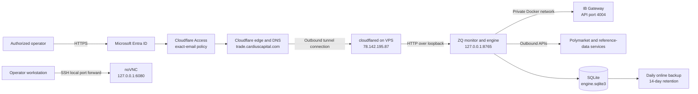

# ZQ Trading System — Current Deployment and Security Architecture

Last updated and VPS settings verified: 2026-09-08  
Environment: Paper Gateway / read-only application  
Active VPS: **78.142.195.87** (`s62219`)  
Public monitor: <https://trade.cardiuscapital.com>

This document reflects the September 8 migration and the settings verified on the new VPS. Cloudflare and Entra policy details below are retained from the original setup record; those administrative settings were not re-audited during migration. Current verification used non-sensitive system configuration and public health/readiness endpoints.

## 1. Executive Summary

The current design separates source control, artifact creation, host configuration, runtime data, and public access.

GitHub is the source and build system. A push to `main` runs validation and creates a container image in GitHub Container Registry (GHCR). The VPS is not automatically changed by that workflow. A specific, immutable image digest must be promoted to the VPS with the deployment script.

The VPS runs the trading engine, the IB Gateway, Cloudflare Tunnel, and local SQLite storage. The application listens only on the VPS loopback interface. Cloudflare Tunnel makes the monitor reachable at `trade.cardiuscapital.com` without opening an application port to the Internet. Cloudflare Access requires Microsoft Entra authentication and authorizes only `leo_ying@lucentti.com`. The application then requires its own dashboard username and password, creating a second authentication layer.

The deployment remains deliberately non-trading. The engine is in `READ_ONLY` mode, and `LIVE_TRADING_ENABLED`, `POLYMARKET_ORDER_SUBMISSION_ENABLED`, and `IBKR_ORDER_SUBMISSION_ENABLED` are all false. IB Gateway is logged into paper mode. Geographic eligibility still blocks application readiness, and intermittent application delays remain; this is not an accepted live-trading deployment.

### 1.1 Active VPS and approved resource settings

| Item | Current setting |
|---|---|
| Active VPS public IP | **78.142.195.87** |
| Hostname and operating system | `s62219`, Debian 13 (trixie), amd64 |
| Host capacity | 8 vCPUs, approximately 8 GiB RAM, approximately 79 GiB root filesystem |
| SSH connection from the workstation | `ssh root@78.142.195.87` |
| ZQ engine CPU allowance | **2 CPUs**, increased from 0.75 |
| ZQ engine RAM limit | **1 GiB**, increased from 384 MiB |
| Gateway Java heap ceiling | **1,024 MiB**, increased from 512 MiB |
| Application worker count | `API_WORKERS=1` |
| Gateway mode and API setting | `TRADING_MODE=paper`, `READ_ONLY_API=no` |
| Application trading controls | `RUN_MODE=READ_ONLY`; all three order-submission switches false |
| Old VPS retained for rollback | **192.109.228.234** (`s61959`); migrated services stopped and automatic startup disabled |

The three resource increases were explicitly approved before application. The Gateway retains no Docker CPU or memory cap; its Java heap ceiling is not a limit on total container memory. `READ_ONLY_API=no` preserves paper-account API functionality, while the ZQ application retains its disabled submission gates. It is not authorization for live trading.

The active engine Compose file and the workstation copy both contain `cpus: 2.0` and `mem_limit: 1g`. The migration changed deployment configuration while preserving the application image. The workstation configuration change has not been committed or pushed to GitHub as part of this work.

## 2. The Configuration Issue That Caused the Login Failure

The initial VPS installation created a new `zq-arb.env` because no server configuration existed yet. The bootstrap script generated a new dashboard password, session-signing key, and control-confirmation secret. Those values are independent of the local development `.env`, the IB Gateway credentials, the IBKR account password, and the Microsoft account used by Cloudflare Access.

The dashboard therefore has two consecutive login layers:

1. Cloudflare Access authenticates the Microsoft identity and checks the allowed email address.

2. The ZQ application authenticates `DASHBOARD_USERNAME` and `DASHBOARD_PASSWORD` from the VPS copy of `zq-arb.env`.

Entering IBKR, Microsoft, or an older local dashboard credential at the second prompt will fail. The first installation creates the file only when it is absent. Normal image deployments preserve it and do not generate new application credentials.

The relevant configuration locations are:

| Purpose | VPS directory | File | Lifecycle |
|---|---|---|---|
| Application secrets and settings | `/etc/zq-arb` | `zq-arb.env` | Created once; edited only on the VPS; never committed |
| Deployed image reference | `/etc/zq-arb` | `deployment.env` | Updated atomically during promotion |
| Cloudflare Tunnel credential | `/etc/cloudflared` | `trade.token` | Stored with restrictive permissions; loaded by systemd |
| IB Gateway credentials and settings | `/opt/ib-gateway` | **`.env`** | **Edit this file on 78.142.195.87 to enter the IBKR login; mode 0600** |
| IB Gateway container definition | `/opt/ib-gateway` | `compose.production.yml` | Reads the Gateway `.env`; image pinned to its existing digest |
| Saved Gateway session and GUI settings | `/opt/ib-gateway` | `tws_settings/` | Mounted at `/home/ibgateway/tws_settings` inside Gateway |
| Application database | `/var/lib/zq-arb` | `engine.sqlite3` | Persistent across container replacements |

The Gateway `.env`, application configuration, and tunnel token were verified as root-owned files with mode `0600`. No secrets belong in GitHub commits, GitHub Actions logs, container image layers, or this document. The migration preserved the existing credentials instead of running first-install credential generation again.

### 2.1 Where to enter or change IB Gateway credentials

The live credential file is **`/opt/ib-gateway/.env` on VPS 78.142.195.87**. It is separate from the workstation project `.env` and the ZQ application file `/etc/zq-arb/zq-arb.env`. Existing Gateway credentials were migrated, so re-entry is needed only if you want to change them.

From a local PowerShell terminal, connect to the active VPS:

```powershell
ssh root@78.142.195.87
```

If the in-app terminal is already connected to that VPS, run `hostname` and confirm it prints `s62219`; do not open another SSH session from inside the VPS.

The enabled `ib-gateway-config.path` service watches `.env` and automatically applies saved changes. For a controlled edit, pause that watcher first, then edit the file on the VPS. `nano` is installed:

```bash
cd /opt/ib-gateway
systemctl stop ib-gateway-config.path
nano .env
```

Update the existing assignments rather than adding duplicate keys. The following values are examples only:

```dotenv
TWS_USERID='your_ibkr_username'
TWS_PASSWORD='your_ibkr_password'
TRADING_MODE=paper
```

Use the credentials accepted for your IBKR paper-account login. `VNC_SERVER_PASSWORD` in the same file controls the Gateway desktop password; it is separate from the IBKR password. Preserve its existing value unless you intend to change the desktop password as well. Keep `JAVA_HEAP_SIZE=1024` and the other approved settings.

Single quotes preserve literal dollar signs in Compose values. If a credential itself contains a single quote, escape it as `\'` within the single-quoted value, following [Docker's environment-file syntax](https://docs.docker.com/compose/how-tos/environment-variables/variable-interpolation/#env-file-syntax).

In nano, save with **Ctrl+O**, press **Enter**, then exit with **Ctrl+X**. Validate and apply the saved file, then resume the watcher:

```bash
chmod 600 .env
docker compose -f compose.production.yml config --quiet && \
  systemctl start ib-gateway-apply.service && \
  systemctl start ib-gateway-config.path
```

If validation or application fails, correct the file and rerun this command; the watcher stays paused until those steps succeed. The apply service runs the pinned-image Compose deployment. A changed credential causes Gateway to be recreated and to log in again, briefly disconnecting its API. A plain `docker restart` does not load changed Compose environment values.

Check the service and Gateway status:

```bash
systemctl status ib-gateway-apply.service ib-gateway-config.path --no-pager
docker ps --filter name=ib-gateway
```

The apply unit is a one-shot service: `inactive (dead)` after a successful exit can be normal; the config watcher should be active. Open the Gateway desktop as described in Section 7 and approve IBKR authentication if requested. If the engine does not reconnect after Gateway finishes logging in, run `docker restart zq-arb-engine` on the active VPS. Do not change application trading gates as part of a credential update.

### 2.2 Account selection required for margin previews

Gateway login and the application's account selection are separate settings. `TWS_USERID` and `TWS_PASSWORD` belong in the Gateway `.env`. **`IBKR_ACCOUNT_ID` belongs in `/etc/zq-arb/zq-arb.env` on 78.142.195.87**, and must identify the intended paper account rather than the login username.

A follow-up diagnosis on September 8 found `IBKR_ACCOUNT_ID` blank in both the saved application file (line 37 at the time of inspection) and the running engine environment. The user subsequently reported entering the account ID in the file; activation of that saved value has not yet been verified. The margin-preview loop requires a configured account before issuing an IBKR what-if request. The missing value explained the dashboard's `NOT_REQUESTED` status and unavailable next-batch initial margin, projected excess liquidity, and projected margin cushion. A connected Gateway and working quotes do not satisfy that separate account-selection requirement.

The corrective configuration change is to enter the intended paper account identifier as `IBKR_ACCOUNT_ID` in the application file, then recreate the engine using Section 5.3 so the changed environment is loaded. Keep `RUN_MODE=READ_ONLY` and all order-submission switches false: the preview path sets `whatIf=True` independently of those execution switches. The account value and runtime configuration were not changed during this diagnosis. A successful preview still requires the verified live ZQ subscription and an acceptable IBKR response.

## 3. Current Architecture



The important trust boundaries are:

1. Cloudflare handles Internet-facing TLS, identity authentication, and the public hostname.

2. The Cloudflare Tunnel connector initiates an outbound connection from the VPS. The application does not need a publicly routable port 8765.

3. The application performs its own authenticated session check after Cloudflare Access.

4. The engine communicates with IB Gateway over a private Docker network, not through the public monitor hostname.

5. Persistent state and secrets live outside the application image, so deploying a new image does not replace them.

## 4. Work Completed in GitHub

### 4.1 Repository and release workflow

The deployment workflow is defined in `container.yml`. It runs for pull requests, pushes to `main`, and manual workflow dispatches.

The Python validation job uses Python 3.12 and a locked dependency set, then runs Ruff, MyPy, and the test suite. The dashboard validation job uses Node 24, installs the locked JavaScript dependencies, and runs linting, tests, and a production build.

For non-pull-request runs, GitHub Actions builds and publishes the application container to GHCR. The workflow uses Docker Buildx caching and emits provenance and an SBOM. Third-party GitHub Actions are pinned to full commit hashes. The workflow uses the repository-scoped `GITHUB_TOKEN`; read permission is the default, while package, attestation, and identity-token writes are limited to the image-publishing job.

The image receives traceable tags, including the Git commit and a mutable staging label. The VPS deployment path does not accept a tag as the final release reference. It requires the immutable `@sha256:` digest, preventing a later tag move from silently changing what is deployed.

### 4.2 Current deployed artifact

The staged deployment was built from Git commit `c12a018` (`Align protobuf runtime with IBKR API`). The deployed image digest is:

```text
sha256:3a383258bd5995de00338f70c2f2bbffb0364b7f62362183ace7efb89a5d44c4
```

GitHub Actions run 5 completed successfully before that digest was promoted.

The September 8 migration retained that exact application digest. Gateway is separately pinned to `ghcr.io/gnzsnz/ib-gateway@sha256:91165c0752ca534c0dad3c40683ae7c2745974d4d277651a90e90411ca609d8d`, preserving the image previously running under the mutable `stable` tag. The new host uses Docker Engine 29.8.0, Compose 5.5.1, and cloudflared 2026.8.3.

### 4.3 What GitHub does not currently do

GitHub Actions does not SSH into the VPS and does not automatically replace the running container. This is intentional for the staging phase. A successful build creates a candidate artifact; a separate operator-controlled promotion selects the exact digest.

The recommended day-to-day code path is therefore:

1. Develop and test on the workstation.

2. Commit and push the change to GitHub.

3. Wait for all GitHub Actions validation and image-publishing jobs to pass.

4. Record the published immutable image digest.

5. Promote that digest on the VPS.

6. Verify health, readiness, dashboard state, venue connectivity, and logs before treating the release as accepted.

There is normally no reason to `git pull` application source onto the production VPS. The deployable unit is the tested container image. The VPS needs only the deployment scaffold, server-only configuration, runtime data, and access to the approved GHCR image.

## 5. VPS Deployment Process

### 5.1 Initial host installation

`install_vps.sh` creates the application, configuration, data, and backup directories; installs the deployment compose file and systemd services; checks for the external `ib-gateway_default` Docker network; and creates `zq-arb.env` only if it does not already exist.

`bootstrap_env.py` refuses to overwrite an existing target. On first installation it generates independent high-entropy values for `DASHBOARD_PASSWORD`, `SESSION_SIGNING_KEY`, and `CONTROL_CONFIRMATION_SECRET` and applies restrictive file permissions. This one-time behavior was the source of the credential mismatch discussed in Section 2, but it also prevents an update from destroying established secrets.

For the September 8 migration, the existing deployment files and credentials were copied to **78.142.195.87** over encrypted SSH streams. The source engine and Gateway were stopped before the final data transfer; the existing SQLite data, backups, and Gateway settings were preserved. Database integrity and a new destination backup were verified. All VPS commands in this section refer to the active host, not the retired source.

### 5.2 Image promotion

`update_vps.sh` requires root privileges and accepts exactly one image reference in the form `ghcr.io/...@sha256:<64 hexadecimal characters>`. It writes the image reference to `deployment.env` atomically, pulls the exact artifact, recreates the application container, and waits up to 90 seconds for the health check. If health fails, it prints recent container logs and exits with an error.

A normal promotion is performed from the application directory:

```bash
cd /opt/zq-arb
sudo deploy/update_vps.sh 'ghcr.io/yzy0806/poly-zq-trading@sha256:REPLACE_WITH_APPROVED_DIGEST'
```

The same command with the previously accepted digest is the rollback procedure. Because configuration and SQLite data are mounted outside the image, rolling the application image backward does not automatically roll back the database schema or server settings. Any future schema migration must therefore include an explicit compatibility and rollback plan.

### 5.3 Configuration changes

Run the following commands on **78.142.195.87** after connecting with `ssh root@78.142.195.87`. Configuration changes are separate from image deployment. To edit the application environment:

```bash
cd /etc/zq-arb
sudoedit zq-arb.env
```

**Saving `zq-arb.env` does not apply the change automatically.** This application file has no automatic config watcher. A plain `docker restart zq-arb-engine` keeps the container's existing environment. After saving an application setting such as `IBKR_ACCOUNT_ID`, validate the Compose configuration and **recreate the engine container**:

```bash
sudo docker compose --env-file /etc/zq-arb/deployment.env \
  -f /opt/zq-arb/deploy/compose.production.yml config --quiet && \
sudo docker compose --env-file /etc/zq-arb/deployment.env \
  -f /opt/zq-arb/deploy/compose.production.yml \
  up -d --no-deps --force-recreate --pull never engine
```

This briefly interrupts the dashboard and engine connections. It uses the already-installed image digest, reloads the saved environment, and retains the mounted database. Gateway and Cloudflare Tunnel continue running. If validation fails, correct the file before retrying. Keep the configuration mode `0600` and retain `RUN_MODE=READ_ONLY` and the three false order-submission switches for the current deployment.

After the engine has started, check process health and the loaded safety settings:

```bash
sudo docker ps --filter name=zq-arb-engine
curl --fail --max-time 5 http://127.0.0.1:8765/healthz
sudo docker exec zq-arb-engine printenv RUN_MODE \
  LIVE_TRADING_ENABLED POLYMARKET_ORDER_SUBMISSION_ENABLED IBKR_ORDER_SUBMISSION_ENABLED
```

For an account-ID edit, verify that a nonempty value reached the running container without printing the identifier:

```bash
sudo docker exec zq-arb-engine python -c "import os; print('IBKR_ACCOUNT_ID nonempty:', bool(os.environ.get('IBKR_ACCOUNT_ID', '').strip()))"
```

`True` confirms a value was loaded; it does not validate that the account is correct or authorized. Once Gateway connectivity and a valid live ZQ subscription are available, check that the dashboard margin preview progresses to `CURRENT`, or inspect the displayed preview error. The preview loop is paced at a minimum 60-second interval between requests. The public `/readyz` endpoint does not include all margin prerequisites and can still return HTTP 503 for the separate geographic-eligibility block.

Gateway credential changes use a different mechanism: `/opt/ib-gateway/.env` is watched by `ib-gateway-config.path`; follow Section 2.1 for controlled editing and application. The application configuration file should not be copied back to the workstation or GitHub. The repository file `zq-arb.env.example` is a non-secret template, not the live configuration.

### 5.4 Container hardening

`compose.production.yml` gives the application a read-only root filesystem, a restricted temporary filesystem, no Linux capabilities, no privilege escalation, an init process, PID, memory, and CPU limits, a loopback-only HTTP binding, a health check, and bounded log rotation. The application joins an internal network and the existing IB Gateway Docker network.

The engine has a **2-CPU allowance and 1-GiB RAM limit**, a 256-process limit, and one application worker. These are the current approved values, replacing the original 0.75-CPU/384-MiB limits. Its restart policy is `unless-stopped`. Persistent files are mounted from `/var/lib/zq-arb`; replacing the container does not replace this directory.

### 5.5 Reboot behavior and old-host standby

Docker, `cloudflared-trade.service`, `ib-gateway-novnc.service`, `ib-gateway-config.path`, and `zq-arb-backup.timer` are enabled on the active VPS. Both application containers use `restart: unless-stopped`. Services are configured for reboot recovery, although a host reboot was not performed as part of migration. IBKR authentication may still be required, and the workstation SSH desktop forward must be recreated after its connection ends.

On **192.109.228.234**, both containers are stopped with restart policy `no`; the tunnel, Gateway config watcher, noVNC, and backup timer are disabled. The host and data remain available for rollback. Before restoring the old services, stop the destination services and preserve and assess the destination database changes. Do not start both deployments with the same Gateway credentials or expose two independent application databases through the same tunnel.

## 6. Work Completed in Cloudflare

### 6.1 Public hostname and tunnel

The Cloudflare-managed zone is `cardiuscapital.com`. A named tunnel, `zq-trade-vps`, serves `trade.cardiuscapital.com` and forwards requests to `http://127.0.0.1:8765` on the VPS.

The `cloudflared` connector is installed as a hardened systemd service. It runs with a dynamic service identity, reads the tunnel token through a systemd credential instead of exposing it on the command line, disables in-process auto-update, restarts on failure, and applies filesystem, device, kernel, syscall, and privilege restrictions.

The active connector now runs on **78.142.195.87**. Migration reused the existing tunnel token and stopped the old connector before starting the new one; no Cloudflare login, DNS edit, or Access-policy change was needed. Four tunnel connections were ready after cutover. An unauthenticated public request returned HTTP 302 to the existing `lucentti.cloudflareaccess.com` login.

This design means Nginx is not currently installed or required for the monitor. Cloudflare terminates public HTTPS, and the tunnel forwards to the loopback-only application service. Nginx would add another component without providing a necessary trust boundary in the present single-service design.

### 6.2 Cloudflare Access application

The self-hosted Access application is named `ZQ Trading Monitor`. Its hostname is `trade.cardiuscapital.com`, its Access session duration is six hours, and its allow policy is restricted to the exact email address `leo_ying@lucentti.com`.

Microsoft Entra ID is the recorded login method. The initial Entra integration failed because its client secret had expired. The Entra/Cloudflare integration was corrected, and a complete external login was verified during the original September 4 setup. That authenticated flow was not repeated during the September 8 migration. The recorded authorization policy is based on the exact email address and does not depend on Entra group membership.

The Entra application has the standard OpenID/profile permissions plus the Microsoft Graph permissions used by Cloudflare's Entra integration. Administrative consent was granted. PKCE was enabled during the configuration review. SCIM provisioning and Entra policy synchronization are not part of the current design.

The Access layer and application layer are intentionally separate. Passing Microsoft login proves that the request is from the authorized organizational identity. Passing the ZQ dashboard login creates the application session and gates application controls. The Cloudflare session is six hours; the application session is configured for up to eight hours, so either layer can require reauthentication independently.

### 6.3 Origin isolation

The application binds to `127.0.0.1:8765`. A remote Internet host cannot directly reach that socket. The only public path is Cloudflare's edge followed by the outbound tunnel. This substantially limits origin-bypass risk even before considering the application login.

Cloudflare recommends validating Access tokens at the origin, either with the tunnel's Access protection setting or inside the application. Loopback binding and the application login provide meaningful defense in depth, but confirmation of explicit origin-side Access JWT validation remains a hardening item before live trading.

## 7. Current Network Exposure

| Service | Listener or path | Intended exposure | Protection |
|---|---|---|---|
| Trading monitor | `127.0.0.1:8765` | Public only through Cloudflare | Access exact-email policy plus application login |
| Application Prometheus metrics | **Not listening** on port `9108` | Configured intent only; not an operational endpoint | Instrumentation remains incomplete |
| Cloudflared connector metrics/readiness | `127.0.0.1:20241` observed after migration | VPS-local only; selected port can change after restart | Loopback binding |
| IB Gateway paper API | Private Docker port `4004`; host `127.0.0.1:4002` | ZQ engine and approved local tooling only | Private Docker networking and loopback binding |
| Reserved Gateway live-port mapping | Host `127.0.0.1:4001` to container `4003` | Mapping retained; Gateway currently runs only paper mode | Loopback binding; no live session claimed |
| IB Gateway VNC | `127.0.0.1:5900` | noVNC or approved SSH forwarding only | VNC password and loopback binding |
| IB Gateway noVNC | `127.0.0.1:6080` | Workstation through SSH forwarding only | SSH authentication and loopback binding |
| SQLite database | Local filesystem | Application and privileged host operators only | Unix permissions, container mount, backups |
| SSH | Host SSH service | Administrative access only | Host SSH policy; firewall and key policy should be periodically audited |

The IB Gateway desktop is not published at `trade.cardiuscapital.com`. From a **local workstation PowerShell terminal**, create an SSH local port forward to the active VPS:

```powershell
ssh -N -o ExitOnForwardFailure=yes -o ServerAliveInterval=30 -L 127.0.0.1:6080:127.0.0.1:6080 root@78.142.195.87
```

Keep that connection running, then open:

```text
http://127.0.0.1:6080/vnc.html?autoconnect=true&resize=scale
```

Enter the `VNC_SERVER_PASSWORD` from the Gateway `.env` when prompted. A forward to the new VPS was started during migration; if port 6080 is already in use by that forward, use it rather than starting a duplicate. Recreate the forward after the SSH connection ends. Keeping noVNC behind SSH avoids exposing a remote desktop login surface through the public monitor.

## 8. Database and Backup Design

The system uses SQLite. No PostgreSQL, MySQL, or other database server is installed or required for the current single-engine deployment. The durable database is `engine.sqlite3` in `/var/lib/zq-arb`.

The backup job uses SQLite's online backup mechanism and runs an integrity check on the result. Backups are stored under `/var/backups/zq-arb`, receive restrictive permissions, and are retained for 14 days.

The database and prior backup history were transferred to 78.142.195.87 after stopping the old writers. Post-transfer integrity was `ok`, and the destination backup service completed with `Result=success` and `ExecMainStatus=0`. Subsequent non-sensitive verification also confirmed the successful backup result.

The systemd backup timer runs daily at 16:20 in the `America/Chicago` time zone, with up to two minutes of randomized delay. Using the exchange-local time zone keeps the schedule aligned through daylight-saving changes.

The present backup is local to the same VPS. It protects against application-level corruption and accidental file loss, but not total VPS or provider loss. An encrypted off-host backup target is still required for disaster recovery.

## 9. IB Gateway Restart and Trading Impact

IB Gateway is configured for an automatic daily restart at 16:10 `America/Chicago`, within the CME daily maintenance interval. Scheduling in `America/Chicago` keeps the restart consistent with CME local market time across daylight-saving transitions.

During the restart, the IBKR API socket disconnects. The engine should mark IBKR unready, prevent new IBKR-dependent execution, and reconnect after the gateway returns. Open orders already resting at IBKR are managed by IBKR during the client disconnect, but local monitoring and modification are temporarily unavailable. The engine must reconcile positions, orders, executions, and market-data subscriptions after reconnection before trading can resume.

The database backup follows at 16:20, after the planned gateway restart. Any strategy expected to operate across the maintenance interval must treat the disconnect as a scheduled risk event rather than an exceptional transient failure.

## 10. Security Controls by Layer

| Layer | Current control | Security purpose |
|---|---|---|
| Source | GitHub repository with reviewed commits | Traceability and change history |
| CI | Locked dependencies, lint, type checks, tests, dashboard build | Reject invalid artifacts before publication |
| Supply chain | SHA-pinned actions, GHCR digest, provenance, SBOM | Reduce dependency and image-substitution risk |
| Promotion | Manual immutable-digest deployment | Separate build success from release approval |
| Secrets | VPS-only environment files, restrictive permissions | Keep credentials out of source and image layers |
| Internet edge | Cloudflare DNS, TLS, Access | Authenticate and authorize before origin access |
| Origin | Outbound tunnel and loopback listener | Prevent direct application-port exposure |
| Application | Independent dashboard login, secure cookies, CORS restriction | Second authentication and session boundary |
| Runtime | Read-only filesystem, dropped capabilities, resource limits | Limit container compromise impact |
| Trading | Read-only mode plus venue-specific order gates | Prevent accidental order submission during staging |
| Data | Persistent SQLite, online integrity-checked backups | Preserve state across deployments and support recovery |
| Operator GUI | SSH-forwarded noVNC | Avoid public remote-desktop exposure |

## 11. Current Operational State and Known Risks

1. The verified deployment mode is `READ_ONLY`; `LIVE_TRADING_ENABLED`, `POLYMARKET_ORDER_SUBMISSION_ENABLED`, and `IBKR_ORDER_SUBMISSION_ENABLED` are false. Gateway is in paper mode. The private runtime armed/halted state was not inspected during migration and is not asserted here.

2. Intermittent application delays remain on the new hardware. A roughly 30-second migration verification sample recorded 18 successful local health requests and two timeouts at a three-second deadline; successful requests ranged from 8.44 to 2,753.11 ms. CPU use averaged approximately 1.04 cores, with 1% of quota periods throttled and approximately 6.7 GiB host memory available. The earlier state-copying/event-loop bottleneck and historical `VENUE_EVENT_QUEUE_OVERFLOW` reports require application work; a restart or resource increase alone does not establish that they are fixed. The measurements are not a controlled before/after benchmark.

3. The September 8 public `/readyz` check returned HTTP 503 with the sole reported reason `geographic eligibility is blocked or indeterminate`. At that sampled time it did not report disconnected venues, missing target quotes/EFFR, unsynchronized books, or an unverified market mapping. The earlier farm disconnect and unsynchronized-book reports are historical findings. The margin diagnosis found a blank `IBKR_ACCOUNT_ID`; the user has since reported filling it in, with runtime activation still unverified. Follow Sections 2.2 and 5.3. `/readyz` does not check that margin prerequisite, so its reasons list is not a complete set of execution blockers. Private account balances, positions, and overall execution readiness remain unverified.

4. The application login limiter currently keys failures from `request.client.host`. Behind a reverse proxy or tunnel, multiple users can appear to come from the same proxy address. Five failed attempts in five minutes can therefore create a shared lockout. The limiter should use a trusted, validated identity or client-IP signal, with proxy-trust rules, before broader access is granted.

5. The original setup record reports that a GitHub personal access token appeared during that workflow. Its rotation status was not reverified during migration; confirm that the exposed token was revoked. Any replacement used only for GHCR pulls should have the narrowest practical scope, normally read-only package access, and should not be stored in application configuration.

6. The Entra client secret needs an owner, expiration record, and renewal alert. The previous expiration already caused an outage. Secret rotation should occur before expiry and be validated with an external Access login.

7. The tunnel currently has one active VPS connector on 78.142.195.87, with four ready Cloudflare connections observed after cutover. The old connector is disabled. Any additional connector serving this stateful application requires explicit application and database failover design; do not turn the old independent database into an accidental second origin.

8. Firewall, SSH key-only authentication, operating-system patching, Docker patching, and fail2ban or equivalent controls should be verified as a separate host-hardening audit. They are expected operational controls, but this document does not claim they were fully audited.

9. The database backup is local only. An encrypted, versioned, off-host backup and a tested restore procedure are required before the VPS becomes the sole production system of record.

10. Explicit origin-side Cloudflare Access token validation should be verified and enabled if absent. This complements, rather than replaces, loopback binding and application authentication.

11. The application Prometheus endpoint is not running; a fresh probe of container-local port 9108 returned connection refused. Do not treat a configured metrics flag or cloudflared's separate connector metrics as working application observability.

12. Automatic approval review rejected the detailed authenticated dashboard check during migration because it would return private application data to the workstation. Non-sensitive health/readiness, system settings, API handshake, database integrity, and tunnel checks were used instead. The document does not claim a new authenticated dashboard review, host reboot test, or peak-load certification.

## 12. Release Acceptance Procedure

Every release should use the following sequence:

1. Confirm the intended Git commit and review its changes.

2. Confirm the Python and dashboard validation jobs passed.

3. Confirm the GHCR artifact digest and record it in the release log.

4. Confirm a recent valid database backup exists.

5. Promote the immutable digest with `update_vps.sh`.

6. Confirm the container reports healthy and remains stable through the initial observation period.

7. Confirm Cloudflare Access works from an external browser and that the application login succeeds.

8. Confirm `/healthz`, application readiness, IBKR connectivity, Polymarket connectivity, synchronized books, account identity, clock health, and absence of critical alerts.

9. Keep all order-submission gates disabled unless a separately approved live-trading checklist authorizes the change.

10. If acceptance fails, redeploy the last accepted digest and repeat state reconciliation. Do not assume an image rollback alone reverses data or external venue state.

## 13. Change Record: What Was Done So Far

1. Installed and configured the containerized IB Gateway on the VPS in paper mode.

2. Aligned the IB Gateway daily restart to 16:10 `America/Chicago`, inside the CME maintenance interval.

3. Added a hardened production compose definition for the ZQ application, using loopback exposure, resource limits, a read-only filesystem, dropped capabilities, health checks, persistent data, and private IB Gateway networking.

4. Added first-install and update scripts that separate one-time secret generation from repeatable immutable-image deployment.

5. Added a GitHub Actions pipeline that validates Python and dashboard code, publishes a GHCR image, generates supply-chain metadata, and supports digest-based deployment.

6. Deployed and verified the image built from commit `c12a018` at the digest recorded in Section 4.2.

7. Created the Cloudflare Tunnel `zq-trade-vps` and routed `trade.cardiuscapital.com` to the loopback-only application service.

8. Installed the tunnel as a hardened systemd service with credential-file loading.

9. Created the Cloudflare Access application `ZQ Trading Monitor`, restricted it to `leo_ying@lucentti.com`, selected Microsoft Entra ID, and set a six-hour Access session.

10. Diagnosed the expired Entra client secret; after the integration was corrected, verified the complete Microsoft-to-Cloudflare-to-application login flow.

11. Added a daily online SQLite backup with integrity checking, restrictive permissions, 14-day retention, and a 16:20 `America/Chicago` schedule.

12. During the original setup, verified that the external dashboard loads and reports live system status while all trading gates remain disabled.

13. On September 8, migrated IB Gateway, the ZQ engine, credentials, persistent data, backup history, noVNC, and the existing Cloudflare Tunnel from 192.109.228.234 to **78.142.195.87**. Preserved the application image and pinned Gateway to its existing image digest.

14. Applied the user-approved engine allowance of **2 CPUs / 1 GiB RAM** and Gateway Java heap of **1,024 MiB**, retaining one worker, paper mode, disabled order gates, and the existing schedules.

15. Verified paper Gateway login/API handshake, database integrity, a destination backup, boot configuration, four ready tunnel connections, the external Access challenge, and the local noVNC page. Recorded the remaining eligibility and application-performance limitations.

16. Stopped the old services and disabled their automatic startup while retaining the source host and data for rollback. Saved the migration handover as `MIGRATION-20260908.md` in `/opt/zq-arb` on the active VPS.

## 14. Implementation References

| File | Responsibility |
|---|---|
| `container.yml` | GitHub validation and GHCR publication |
| `Dockerfile` | Reproducible application image |
| ZQ `compose.production.yml` in `/opt/zq-arb/deploy` | Hardened engine runtime; 2 CPUs and 1 GiB RAM |
| Gateway `.env` in `/opt/ib-gateway` | **IBKR username/password, VNC password, paper mode, and Java heap setting** |
| Gateway `compose.production.yml` in `/opt/ib-gateway` | Pinned Gateway image and loopback API/VNC mappings |
| `apply-config.sh` in `/opt/ib-gateway` | Validate, pull the pinned image, and apply Gateway Compose configuration |
| `ib-gateway-config.path` and `ib-gateway-apply.service` | Watch the Gateway `.env` and apply saved changes |
| `ib-gateway-novnc.service` | Loopback-only Gateway desktop web access |
| `install_vps.sh` | Initial host setup |
| `bootstrap_env.py` | One-time secret and environment bootstrap |
| `update_vps.sh` | Immutable-digest promotion and health verification |
| `zq-arb.env.example` | Non-secret configuration contract |
| `cloudflared-trade.service` | Hardened Cloudflare Tunnel service |
| `zq-arb-backup.service` | Online SQLite backup job |
| `zq-arb-backup.timer` | CME-aligned backup schedule |

## 15. External References

1. Cloudflare, [Microsoft Entra ID integration](https://developers.cloudflare.com/cloudflare-one/integrations/identity-providers/entra-id/).

2. Cloudflare, [Self-hosted public applications](https://developers.cloudflare.com/cloudflare-one/access-controls/applications/http-apps/self-hosted-public-app/).

3. Cloudflare, [Access policies](https://developers.cloudflare.com/cloudflare-one/access-controls/policies/).

4. Cloudflare, [Cloudflare Tunnel](https://developers.cloudflare.com/cloudflare-one/networks/connectors/cloudflare-tunnel/).

5. IB Gateway Docker project, [image configuration and credential variables](https://github.com/gnzsnz/ib-gateway-docker).

6. Docker, [Compose environment-file syntax](https://docs.docker.com/compose/how-tos/environment-variables/variable-interpolation/#env-file-syntax).

## 16. Ownership Boundary

GitHub owns source history, automated validation, and immutable artifact publication. Cloudflare owns the public hostname, edge TLS, identity authentication, authorization policy, and tunnel routing. The VPS owns runtime secrets, deployment selection, IB Gateway state, the application database, backups, and container lifecycle. Interactive Brokers and Polymarket remain the authoritative external venues for orders, fills, positions, and account state.

That separation is intentional. A GitHub push cannot silently replace VPS secrets, a container update cannot silently replace the SQLite database, and possession of the public URL alone does not grant access to the application or trading controls.
